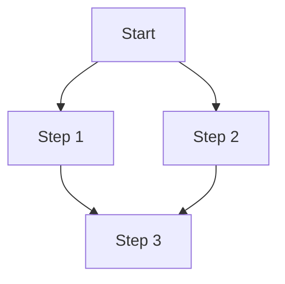
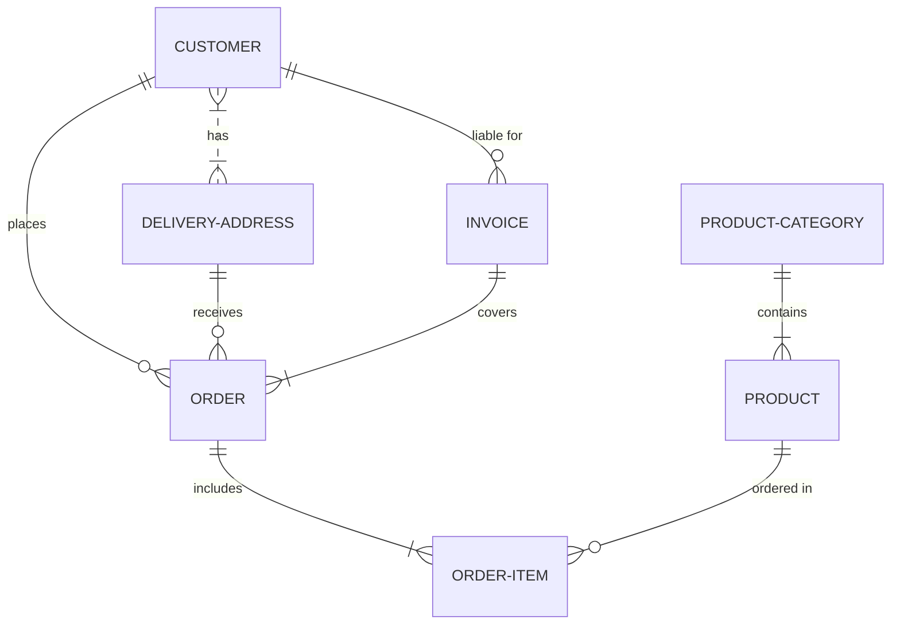

# Diagrams

Create diagrams using `mermaid` and `geojson`

## Mermaid

### Graph Diagram (Flowchart):



### Entity-Relationship Diagram (ER Diagram):




## Maps

### Example 1 (Polygon):

```geojson
{
  "type": "FeatureCollection",
  "features": [
    {
      "type": "Feature",
      "id": 1,
      "properties": {
        "ID": 0
      },
      "geometry": {
        "type": "Polygon",
        "coordinates": [
          [
            [123.80, 15.31],
            [123.80, 10.31],
            [118.80, 10.31],
            [118.80, 15.31],
            [123.80, 15.31]
          ]
        ]
      }
    }
  ]
}
```
