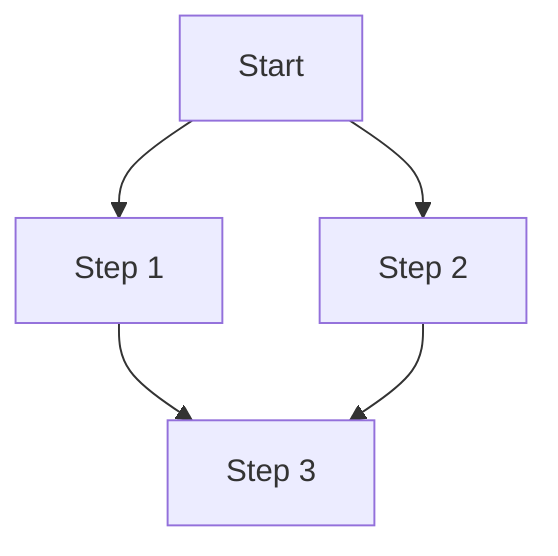
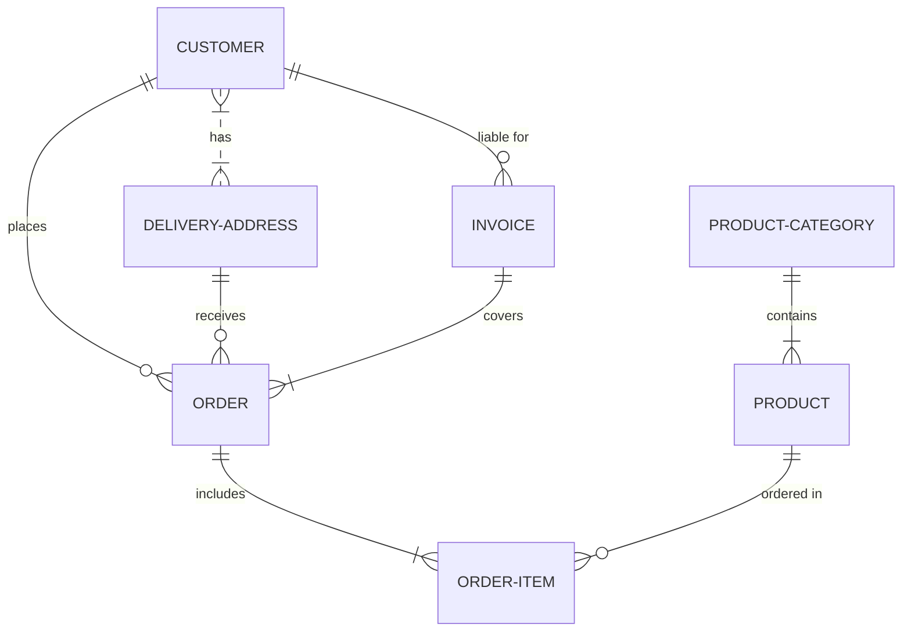
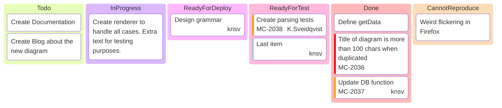

# Diagrams

Create diagrams using `mermaid` and `geojson`

## Mermaid

### Graph Diagram (Flowchart):



### Entity-Relationship Diagram (ER Diagram):



### Kanban Board:



## Maps

### Example 1 (Original Polygon):

```geojson
{
  "type": "FeatureCollection",
  "features": [
    {
      "type": "Feature",
      "id": 1,
      "properties": {
        "ID": 0
      },
      "geometry": {
        "type": "Polygon",
        "coordinates": [
          [
            [-90, 35],
            [-90, 30],
            [-85, 30],
            [-85, 35],
            [-90, 35]
          ]
        ]
      }
    }
  ]
}
```

### Example 2 (Polygon with Updated Coordinates):

```geojson
{
  "type": "FeatureCollection",
  "features": [
    {
      "type": "Feature",
      "id": 1,
      "properties": {
        "ID": 0
      },
      "geometry": {
        "type": "Polygon",
        "coordinates": [
          [
            [-90, 35],
            [-90, 30],
            [-85, 30],
            [-85, 35],
            [-90, 35],
            [123.885389, 10.3156944]
          ]
        ]
      }
    }
  ]
}
```