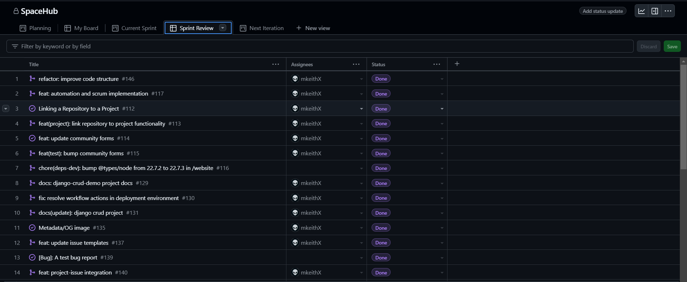

<!-- # Exciting Updates: Reviving Django with Algolia Search and GitHub Integration -->

**Hey everyone!**

Excited to share some updates that have been brewing for a while. Here’s what I’ve been working on!

- **Github Projects** : Manage everything from issues to pull requests.
- **Django** : Getting back to the web framework for perfectionists with deadlines.
- **Workflows** : Revamped CI/CD using GitHub Actions workflows.


<Card>
    <CardImage
      cardImageUrl='/img/new-blog-default.png'
    />
  </Card>

<br></br>


{/* truncate */}

## GitHub Projects

One of the biggest steps I’ve taken recently is integrating GitHub into my project. This has completely transformed how I manage everything from issues to pull requests.




### What's in it
- **Streamlined Workflow**: I can now sync issues, pull requests, and commits directly with my dashboard, making tracking progress so much easier!

<!--  -->

- **Enhanced Collaboration**: Working with contributors has become more efficient; I can keep everyone updated without jumping between different tools.
- **Automated Actions**: I’ve set up specific triggers for GitHub events, allowing me to automate parts of my workflow and focus on development.

This integration has simplified the development process and made it a lot more enjoyable! 

More about [GitHub Projects](https://docs.github.com/en/issues/planning-and-tracking-with-projects).


## Reviving Django

<Card>
    <CardImage
      cardImageUrl='/img/projects/django-crud-demo.png'
    />
  </Card>

<br></br>

I decided it was time to refresh my Django skills, and I’m really excited about it. After some time off, I'm happy to introduce the django-crud-demo project -  A simple yet effective way to explore CRUD (Create, Read, Update, Delete) operations using Django. 

### Features

- **Custom User Model** : Extend the default user model using AbstractUser to add fields like bio or profile picture while retaining authentication features.
- **PostgreSQL** : Use PostgreSQL as the database backend.
- **More** : Custom features such as creating dummy users, age restriction ect..

### Install

Clone to it in your local machine:

```bash
git clone https://github.com/mkeithX/django-crud-demo.git
```
Visit [the repo](https://github.com/mkeithX/django-crud-demo) to know more.

## Enhancements

### Feature Requests

I’ve also streamlined the process for feature requests, allowing anyone interested in the project to suggest improvements. Your feedback is invaluable, and I’m excited to incorporate ideas that can elevate the project to the next level.

### Cloudflare

Additionally, I’ve integrated GitHub actions via Cloudflare, adding an extra layer of security and performance. It’s reassuring to know my code is protected while benefiting from Cloudflare’s speed.

## GitHub Actions Workflow

To further enhance my development process, I’ve set up a GitHub Actions workflow to automate testing and deployment. 

<details>

<summary>View workflow configuration</summary>

```yaml
name: "Setup Python"

on:
  push:
    branches:
      - main
  pull_request:
    branches:
      - main

jobs:
  build:
    runs-on: ubuntu-latest
    strategy:
      fail-fast: false
      matrix:
        python-version: ["3.10", "3.11"]

    steps:
      - uses: actions/checkout@v4
      - uses: actions/setup-python@v5
        with:
          python-version: ${{ matrix.python-version }}
      - name: Install dependencies
        run: |
          python -m pip install --upgrade pip
          pip install --upgrade -r requirements.txt
      - name: Hello world
        run: |
          python hello_world.py
```
This workflow ensures that every push and pull request triggers tests, helping me maintain code quality and reliability.

</details>


## What's Next

I’m excited about what’s coming up:

- **New Features**: I’ll be adding more features based on your feedback.
- **Performance Improvements**: I’ll focus on optimizing the project further.
- **Community Input**: I want to engage more with everyone to gather ideas.
- **Better Documentation**: I’ll continue improving the documentation for easier navigation.

Thanks for your time and happy coding!
