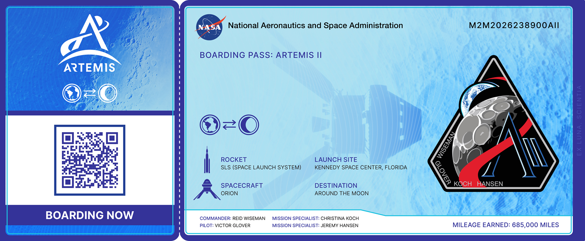

import Tabs from '@theme/Tabs';
import TabItem from '@theme/TabItem';
import IframeWindow from '@site/src/components/BrowserWindow/IframeWindow';

import BrowserWindow from '@site/src/components/BrowserWindow';

**Going back to Moon!**

It’s been over fifty years since Apollo, and now NASA is getting ready to take humans back toward the Moon with Artemis II—the first crewed mission of the Artemis program. 

<!-- truncate -->

## The Mission

Launch is targeted for April 2026, and this time, four astronauts will make history: the first woman and the first person of color on a lunar mission. They’ll spend about 10 days flying around the Moon aboard the Orion spacecraft, powered by the mighty Space Launch System (SLS) rocket.
This trip isn’t about landing just yet-it’s about making sure life-support systems and other critical tech are ready for future missions. Think of it as a big dress rehearsal for what’s coming next..

## Building on Success

Artemis II follows the success of Artemis I, the uncrewed test flight that wowed the world in 2022. And it’s paving the way for Artemis III, planned for 2027, when astronauts will land at the Moon’s South Pole for the first time ever.
Why does this matter? Because NASA’s bigger vision is bold: create a sustainable presence on the Moon and use it as a launchpad for human missions to Mars. This isn’t just about going back—it’s about going farther.

## Innovation and Collaboration

NASA isn’t just testing rockets and spacecraft. They’re also introducing new tech like the AxEMU spacesuit, designed for better mobility and safety during future moonwalks. And they’re not doing it alone-international partners, including the Canadian Space Agency, are contributing hardware and crew support. It’s truly a global effort.

## Join the Adventure

**Here’s something fun**: you can send your name to the Moon! NASA’s “Send Your Name to the Moon” campaign lets you submit your name and download a virtual boarding pass. All names will be stored on an SD card flying inside Orion during Artemis II.

Get your [boarding pass here](https://www3.nasa.gov/send-your-name-with-artemis/) 🚀

_Artemis represents a new era of spaceflight, one that blends science, technology, and international cooperation to push humanity farther than ever before. The countdown to launch has begun—get ready for the next giant leap._

'till next time
