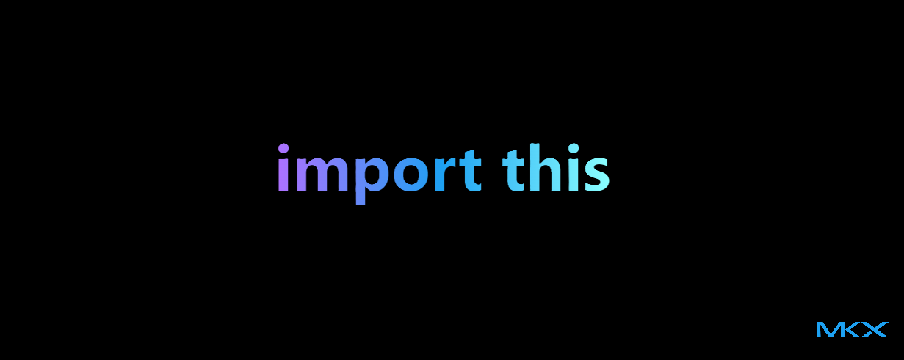

import Tabs from '@theme/Tabs';
import TabItem from '@theme/TabItem';
import BrowserWindow from '@site/src/components/BrowserWindow';


**The Zen of Python**

In this post, let's talk about the 19 aphorisms along with simple definitions and practical examples.




{/* truncate */}

## Easter Egg

:::tip[Know this]

The **Zen of Python**, authored by [Tim Peters](https://en.wikipedia.org/wiki/Tim_Peters_(software_engineer)), is both a set of guiding principles for writing Pythonic code and a fun [Easter egg](https://en.wikipedia.org/wiki/Easter_egg_(media)) hidden within Python itself.

:::

To see Zen of Python, run either:

<Tabs>
  <TabItem value="pyscript" label="Python shell" default>

     ```python
     import this
     ```
  </TabItem>
  <TabItem value="pyshell" label="Terminal">

    ```sh
    python -c 'import this'
    ```

  </TabItem>
</Tabs>

<pre>
The Zen of Python, by Tim Peters

Beautiful is better than ugly.
Explicit is better than implicit.
Simple is better than complex.
Complex is better than complicated.
Flat is better than nested.
Sparse is better than dense.
Readability counts.
Special cases aren't special enough to break the rules.
Although practicality beats purity.
Errors should never pass silently.
Unless explicitly silenced.
In the face of ambiguity, refuse the temptation to guess.
There should be one-- and preferably only one --obvious way to do it.
Although that way may not be obvious at first unless you're Dutch.
Now is better than never.
Although never is often better than *right* now.
If the implementation is hard to explain, it's a bad idea.
If the implementation is easy to explain, it may be a good idea.
Namespaces are one honking great idea -- let's do more of those!

</pre>

:::caution[important]

If you run into issues, it's likely that Python is not installed on your machine. [Download it here](https://www.python.org/downloads/).

:::


---

## `import this`

### Beautiful is better than ugly

<details>
<summary>Code for humans.</summary>

Clean, readable code is easier to understand and maintain.

* **⭕ Good**
    ```python
    def f(x):
        return x*x + 2*x + 1
    ```
* **✅ Better**
    ```python
    def quadratic(x):
        return x * x + 2 * x + 1
    ```
</details>

### Explicit is better than implicit

<details>
<summary>Make it obvious.</summary>

Avoid hidden meanings and ensure that the purpose of the code is obvious. Clear code is easier to understand than clever shortcuts.

* **⭕ Good**
    ```python
    from math import *  # What is being imported?
    ```
* **✅ Good**
    ```python
    from math import sqrt, pi  # Explicit and clear
    ```

</details>


### Simple is better than complex

<details>
<summary>Avoid unnecessary complexity.</summary>

Complex solutions should only be used when absolutely necessary. Simplicity leads to better code.

* **❌ Complicated**
    ```python
    def add(a, b): 
        return (lambda x, y: x + y)(a, b)
    ```
* **✅ Simplified**
    ```python
    def add(a, b):
        return a + b
    ```

</details>


### Complex is better than complicated

<details>
<summary>If complexity is necessary, structure it well.</summary>

Code should be well-structured and understandable, not convoluted or confusing.


* **❌ Complicated**
    ```python
    def factorial(n):
        return 1 if n == 0 else n * factorial(n - 1)
    ```
* **✅ Complex but better**
    ```python
    def factorial(n):
        result = 1
        for i in range(1, n + 1):
            result *= i
        return result
    ```

</details>


### Flat is better than nested

<details>
<summary>Avoid deep nesting that makes code hard to follow.</summary>

Flat code is easier to read and manage.

* **⭕ Good**
    ```python
    if user:
    if user.is_active:
        if user.has_permission():
            print("Access granted")
    ```
* **✅ Good**
    ```python
    if user and user.is_active and user.has_permission():
        print("Access granted")
    ```
</details>


### Sparse is better than dense

<details>
<summary>Whitespace improves readability.</summary>

Dense code can be hard to read and understand. Spread out code with appropriate spacing. 

* **⭕ Good**
    ```python
    x=[1,2,3];y=4;z=x+y
    ```
* **✅ Good**
    ```python
    x = [1, 2, 3]
    y = 4
    z = x + y
    ```


</details>


### Readability counts

<details>
<summary>Code is read more often than it is written. </summary>

Prioritize readability to make it easier for others (and yourself) to understand and maintain.

* **❌ Less Readable**
    ```python
    def d(a,b,c):
        return (a+b)*c
    ```
* **✅ Readable**
    ```python
    def calculate(a, b, c):
        return (a + b) * c
    ```


</details>


### Special cases aren't special enough to break the rules

<details>
<summary>Consistency is key.</summary>

Stick to the rules and conventions of the language, even for special cases.

* **Following the rules**
    ```python
    def divide(a, b):
        if b == 0:
            raise ValueError("Cannot divide by zero")
        return a / b
    ```
* **Breaking the rules**
    ```python
    def divide(a, b):
        if b == 0:
            return None
        return a / b
    ```

</details>


### Although practicality beats purity

<details>
<summary>Sometimes, breaking a rule is okay for practical reasons.</summary>

While following best practices is important, practical solutions should take precedence when necessary. Using `try-except` instead of checking every possible edge case:

```python
try:
    value = int(user_input)
except ValueError:
    print("Invalid number")
```
**Comparison**

* **Practical**
    ```python
    def read_file(file_path):
        try:
            with open(file_path, 'r') as file:
                return file.read()
        except FileNotFoundError:
            return "File not found"
    ```
* **Pure**
    ```python
    def read_file(file_path):
        with open(file_path, 'r') as file:
            return file.read()
    ```


</details>


### Errors should never pass silently

<details>
<summary>Handle errors explicitly.</summary>

Ignoring errors can lead to unexpected behavior and bugs.

* **⭕ Good**
    ```python
    try:
        risky_function()
    except:
        pass  # Silently ignores all errors
    ```
* **✅ Good**
    ```python
    try:
        risky_function()
    except Exception as e:
        print(f"Error: {e}")
    ```

</details>


### Unless explicitly silenced
<details>
<summary>If ignoring an error is intentional, document it.</summary>


If an error must be ignored, it should be done explicitly and with good reason.

    ```python
    try:
        os.remove("foobar.txt")
    except FileNotFoundError:
        pass  # It's okay if the file doesn't exist
    ```
</details>


### In the face of ambiguity, refuse the temptation to guess

<details>
<summary>Do not make assumptions.</summary>


Write clear logic rather than making assumptions. When code behavior is unclear, seek clarity and ensure the code's intent is explicit.


* **❌ Guessing**
    ```python
    def get_user_age(user):
        return user.get('age', 0)  # Assuming age is 0 if not found
    ```
* **✅ Seeking clarity**
    ```python
    def get_user_age(user):
        if 'age' in user:
            return user['age']
        else:
            raise KeyError("User age not found")
    ```
</details>


### There should be one—and preferably only one—obvious way to do it

<details>
<summary>Clear and consistent.</summary>

Python emphasizes having a single, clear way to accomplish a task, reducing confusion and increasing consistency.

* **❌ Multiple ways (Confusing)**
    ```python
    import os
    os.system("ls")  # One way
    import subprocess
    subprocess.run(["ls"])  # Another way
    ```
* **✅ Preferred**
    ```python
    import pathlib
    print(list(pathlib.Path(".").iterdir()))
    ```

</details>


### Although that way may not be obvious at first unless you're Dutch

<details>
<summary>Here's why</summary>

Python might seem tricky at first, but it makes more sense once you get used to it, especially if you're familiar with its Dutch creator, [Guido van Rossum](https://en.wikipedia.org/wiki/Guido_van_Rossum).

</details>


### Now is better than never

<details>
<summary>Don’t over-optimize; ship working code.</summary>


It's better to take action and write code now rather than procrastinate.

```python
print("Launching Project...")
```

</details>


### Although never is often better than *right* now

<details>
<summary>Don’t rush bad code—balance speed and quality.</summary>

Rushing to write code without proper thought can lead to poor quality. Balance urgency with careful consideration.

</details>


### If the implementation is hard to explain, it's a bad idea

<details>
<summary>Code should be simple enough to explain easily.</summary>


If it's too complex to explain, it likely needs to be simplified.


* **❌ Difficult to explain**
    ```python
    def mystery(x):
        return (x & (x - 1)) == 0
    ```
* **✅ Better**
    ```python
    def is_power_of_two(x):
        return x > 0 and (x & (x - 1)) == 0
    ```
</details>

### If the implementation is easy to explain, it may be a good idea

<details>
<summary>The value of simplicity and clarity in coding.</summary>

When an implementation is easy to explain, it usually means that the code is straightforward, understandable, and maintainable. Simple and clear implementations are often the best solutions.

    ```python
    def factorial(n):
        if n == 0:
            return 1
        else:
    return n * factorial(n-1)
    ```


</details>


### Namespaces are one honking great idea—let's do more of those!

<details>
<summary>Using namespaces</summary>

Namespaces help organize code and avoid naming conflicts. Use them liberally to keep code clean and modular.

    ```python
    import math
    print(math.sqrt(16))  # Using the math namespace to access sqrt function
    ```

</details>


## Learn more!

* [PEP](https://peps.python.org/)
* [Index](https://peps.python.org/pep-0020/)
* [Easter egg](https://en.wikipedia.org/wiki/Easter_egg_(media))
* [BDFL](https://en.wikipedia.org/wiki/Benevolent_dictator_for_life)

---

**Happy coding!** 🚀

