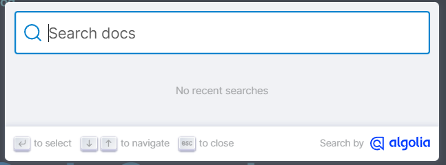
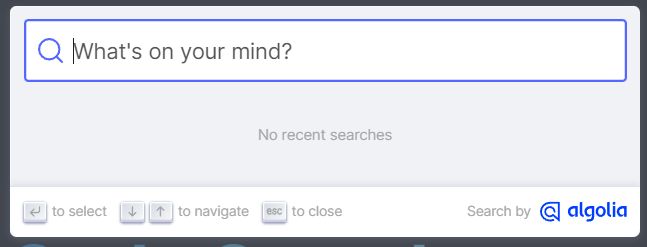
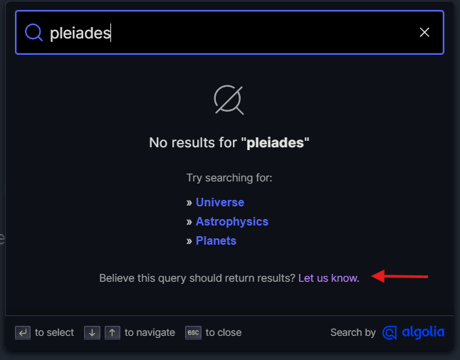
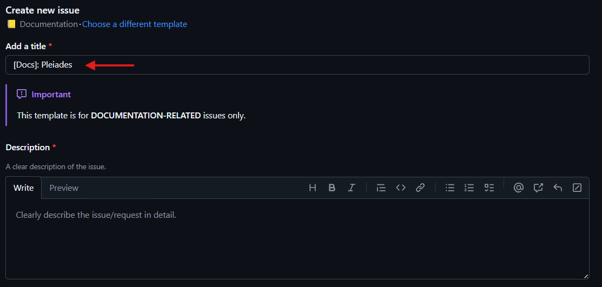
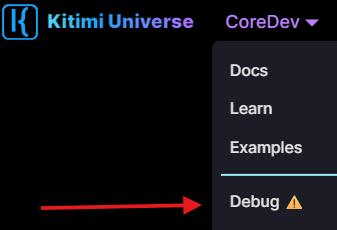

import Tabs from '@theme/Tabs';
import TabItem from '@theme/TabItem';
import BrowserWindow from '@site/src/components/BrowserWindow';
import Image from '@theme/IdealImage';

# Update: July 2025

Announcing the **July 2025** update!

This update includes site improvements, new articles, in collaboration with the Kitiplex Engineering Team.

import socialcard from './img/social-card.png';

<Image img={socialcard} />

{/* truncate */}

## Highlights

### Revamp Docs

- **Microsoft 365 Admin Guides:** New articles on [system administration](/docs/system-administration) covering Entra ID, Exchange, and Intune.
- **Docusaurus Plugin Extensions:** Step-by-step guides for [rendering math equations with KaTeX](/docs/guides/docs/advanced/math-equations), [custom diagrams with Mermaid](/docs/guides/docs/advanced/custom-diagrams), and more.

### Improved Search Experience

See Search Improvements

Custom search modal placeholder: "_What's on your mind?_" for a friendlier UX.

<Tabs className="unique-tabs">
<TabItem value="before" label="Before">

</TabItem>
<TabItem value="after" label="After">

</TabItem>
</Tabs>

Added a direct link to report documentation issues when no search results are found.

### Local Development & Debugging

Debug Features

- `Dev` badge now appears when running locally.
- New `Debug` option for easier troubleshooting and testing.

  

## Roadmap

Here’s what’s coming next:

- **Smarter Search:** Even faster and more intuitive.
- **Advanced Admin Guides:** Deep dives into Microsoft 365 and Docusaurus.
- **Interactive Tutorials:** Hands-on walkthroughs for setup and customization.
- **Accessibility:** Making docs more inclusive for all users.

## Feedback

Your feedback is invaluable! If you have suggestions, spot an issue, or want to request a feature, please [open an issue](https://github.com/mkeithx/mkeithx.github.io/issues) or reach out directly.

<!-- This release is dedicated to [Comet 3I/ATLAS](https://science.nasa.gov/blogs/planetary-defense/2025/07/02/nasa-discovers-interstellar-comet-moving-through-solar-system/) and marks a new chapter for this project, with a strong focus on community-driven enhancements and technical depth. -->
<!-- 
## Acknowledgement

<Columns className='item margin-bottom-lg'>

<Column className="text--left item padding--tl">
  <Card shadow="tl">
    <CardHeader className="padding-top--lg">
      

        
        

          
KPXEng

          <small class="avatar__subtitle">Engineering Team</small>
        

      

    </CardHeader>
  </Card>
</Column>

<Column className="text--left item  padding--tl">
  <Card shadow="tl">
    <CardHeader className="padding-top--lg">
      

        
        

          
Keith Tan

          <small class="avatar__subtitle">Lead @ Kitimi Engineering</small>
        

      

    </CardHeader>
  </Card>
</Column>

</Columns> -->

Thank you for your time and stay tuned for more!