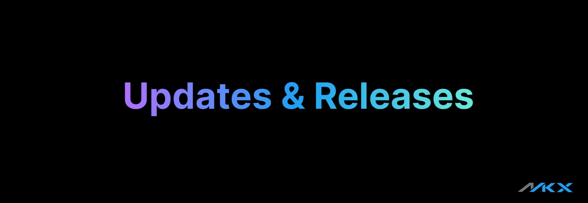

import Tabs from '@theme/Tabs';
import TabItem from '@theme/TabItem';
import BrowserWindow from '@site/src/components/BrowserWindow';

import Image from '@theme/IdealImage';
import socialcard from './img/social-card.png';

import debug from './img/debug-option.png';

**Hello, world!** 

Here's a look at what I've been working on recently!

<!--  -->

<Image img={socialcard} />

<!-- <Image img={require('./img/social-card.png')} /> -->

<!-- truncate -->

This post marks my first official update in collaboration with the Kitiplex Team, as previously announced. I'm excited to outline a few key improvements and additions:

## Revamping the Docs

As part of the Microsoft 365 Developer Program, I’ve introduced foundational articles covering Microsoft 365, Entra ID, Intune, and more. You can check them out in the [System Administration section](/docs/system-administration).

Beyond that, I’ve made substantial improvements to the guides on building and customizing documentation websites with Docusaurus—great for anyone looking to scale their technical docs.

## Contributor Tips

If you're running the site locally, you’ll notice a few helpful development features:

- A `Dev` badge displayed during local development.
- A `Debug` option to assist with testing and troubleshooting.

<!--  -->

<Image img={debug} />