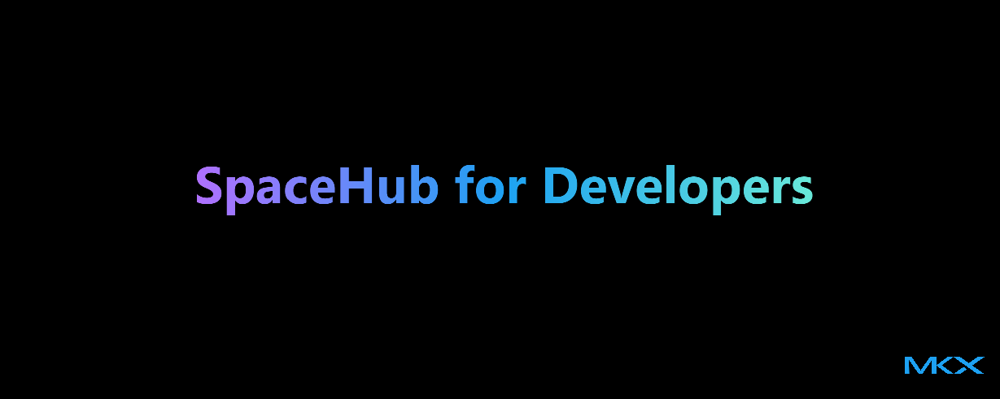

import postBanner from './img/banner.png';
import devBanner from '/img/logo/developers-a.png';
import spaceDocs from '/img/intro-banner-docs.png';

import useBaseUrl from '@docusaurus/useBaseUrl';

 

{/* truncate */}

## `HelloWorld.Again()`

This our first post as a team and a whole bunch of exploration to follow.

