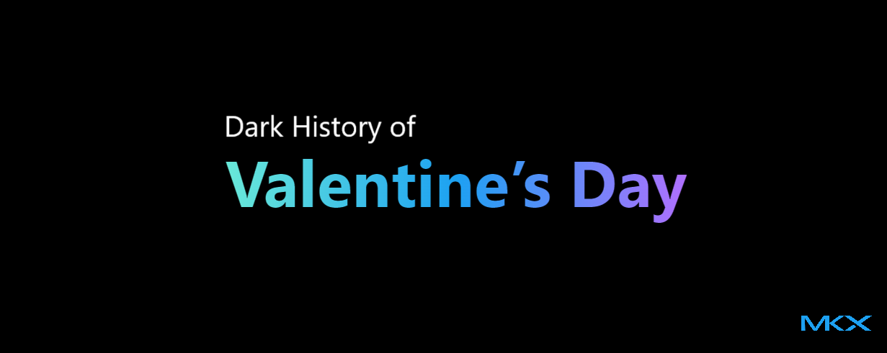

**Secret marriage, dark rituals, and a priest**.

Far from the heart-shaped candy and candlelit dinners we know today, the origins of this day were rooted in blood, legend, and some uncomfortable truths.

{/* truncate */}

<!-- Valentine’s Day is often seen as a celebration of love, roses, and chocolates, but beneath the surface lies a darker history filled with sacrifice, martyrdom, and ancient rituals.  -->

### Where Did Valentine’s Day Begin?
> The Origins

Long before Valentine’s Day became associated with romance, it was tied to the ancient Roman festival of [**_Lupercalia_**](https://en.wikipedia.org/wiki/Lupercalia), celebrated in mid-February. Lupercalia was a festival dedicated to fertility, and its rituals were far from sweet. The festivities included sacrifices, where goats and dogs were slaughtered, and their blood was smeared on participants. Young men, armed with strips of goat hide, would run through the streets, striking women in hopes of increasing their fertility. This brutal tradition was replaced in the 5th century by [Pope Gelasius I](https://en.wikipedia.org/wiki/Pope_Gelasius_I), who sought to Christianize the event and turned it into a day to honor St. Valentine.

### Who Was Valentine?
> The Saint

The modern holiday is named after [St. Valentine](https://en.wikipedia.org/wiki/Saint_Valentine), a priest who lived during the reign of Emperor Claudius II in the 3rd century AD. The emperor, believing that single men made better soldiers, banned marriages for young men. Valentine, defying the emperor’s orders, continued to secretly marry couples in love. When his actions were discovered, he was arrested, tortured, and eventually executed. Some versions of the story claim that Valentine left a note for his jailer’s daughter, signing it “from your Valentine,” making it one of the first recorded love letters.

The bloody end of Valentine’s life became a symbol of love and sacrifice, though the true details of his story remain unclear and varied across different versions of the legend. What is certain, however, is that his martyrdom was far from the sweet sentiments we associate with the holiday today.

### When Did it Shift to Romance?
> The Transition

After [the fall of Rome](https://en.wikipedia.org/wiki/Fall_of_the_Western_Roman_Empire), Valentine’s Day slowly transitioned into a more celebratory day for lovers, thanks to poets like [Geoffrey Chaucer](https://en.wikipedia.org/wiki/Geoffrey_Chaucer). His 14th-century poem, *[Parliament of Foules](https://en.wikipedia.org/wiki/Parlement_of_Foules)*, linked the day to the mating of birds, cementing the association between February 14th and romance. Yet, even as the holiday became more about affection than execution, it was still entangled with dark elements, such as the continued use of symbolism from the ancient, violent festivals.

### How did Valentine’s Day go from sacrifice to shopping?
> Commercialized

In the 19th century, the first commercially produced Valentine’s cards appeared, further shifting the focus of the day toward materialism and consumerism. This began the rise of the modern Valentine's Day industry—flowers, chocolates, cards, and gifts—all born from a holiday with roots in sacrifice and suffering.

<!-- ### The Bloodshed of Love
While we now know Valentine’s Day as a celebration of affection, it’s important to remember the blood-stained history behind it. From the violent rites of Lupercalia to the martyrdom of a priest for defying a tyrant, the day has evolved from sacrifice to sentiment. Today’s box of chocolates and bouquet of roses may feel like an innocent tradition, but they are built on a long, complicated, and occasionally dark history. -->

## Final Thoughts
<!-- 
Valentine’s Day reminds us that love is often entwined with sacrifice, and that even the sweetest holidays have a past filled with blood, struggle, and pain. So, as you celebrate with chocolates and flowers, spare a thought for the dark history that made it all possible. -->

Valentine’s Day shows us that love often comes with sacrifice, and even the sweetest holidays have a dark past of pain and struggle. So, while you're enjoying chocolates and flowers, take a moment to remember the history behind it all.

**Happy Valentines and Cheers to all the folks born in November!**
