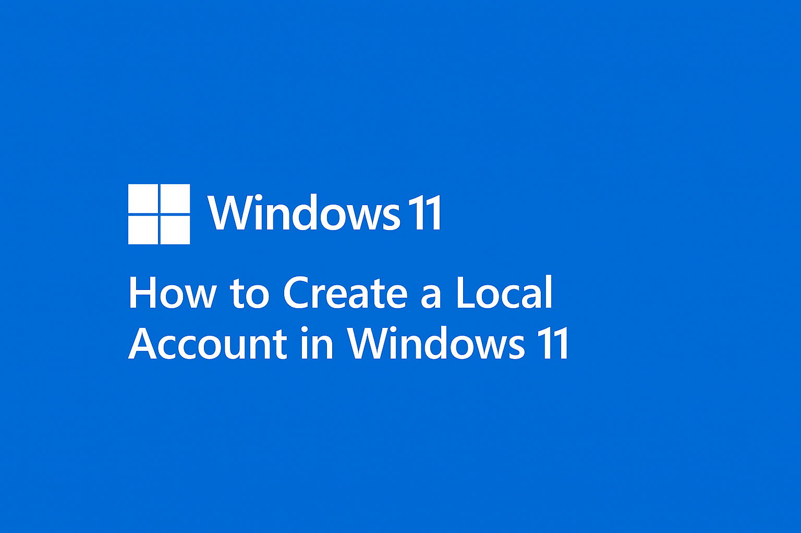

**Windows 11**

If you're setting up Windows 11 and prefer not to use a Microsoft account, you're not alone. 

<!-- truncate -->

Many users—especially those concerned with privacy or deploying devices in bulk—want a simple way to create a local account.

During the initial setup of Windows 11 (especially Home edition), when you're prompted to sign in with a Microsoft account and there's no visible option to create a local account.
