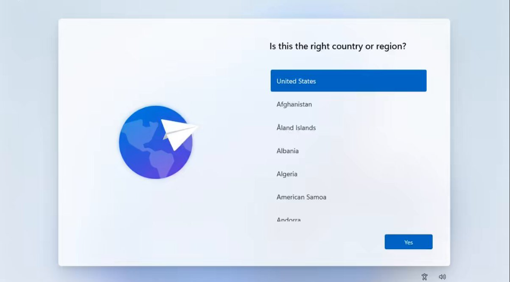
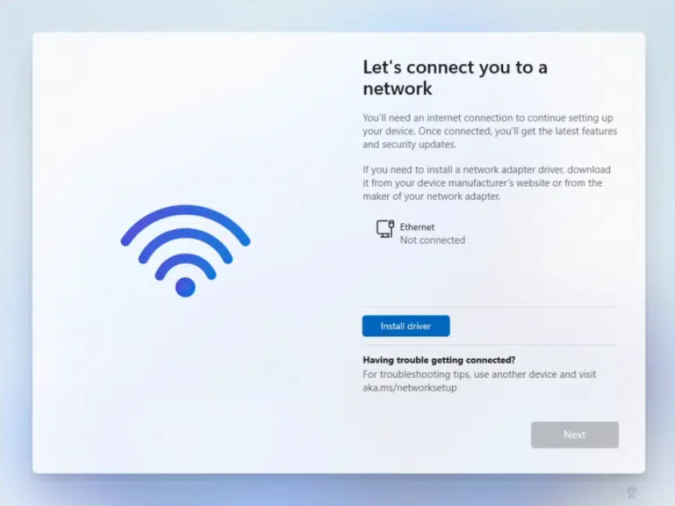
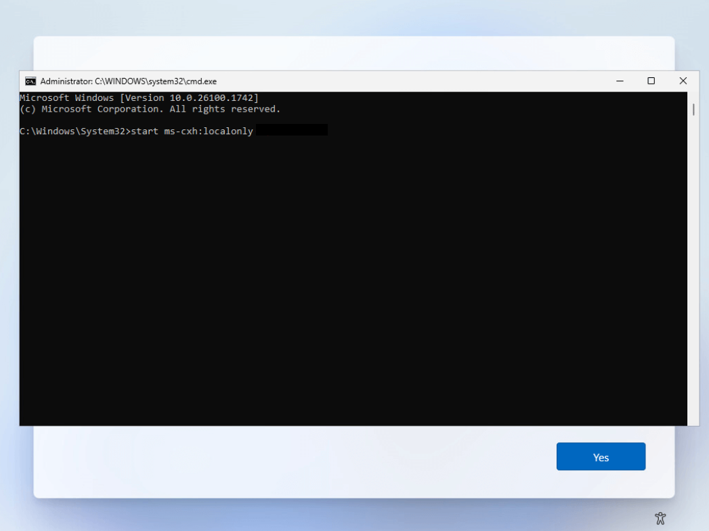
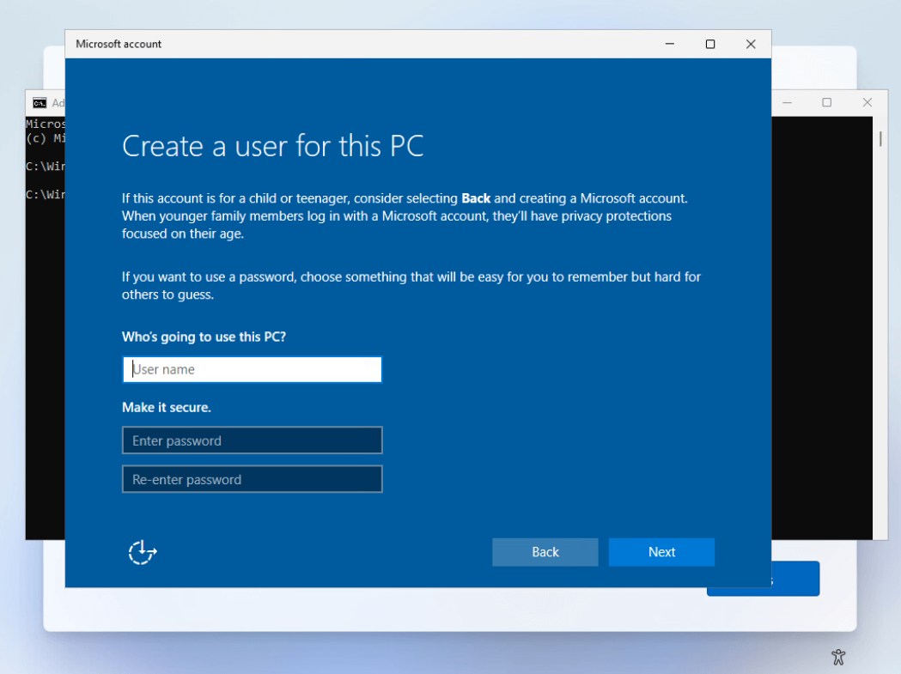

import Video from '@site/src/components/Video';
import BrowserWindow from '@site/src/components/BrowserWindow';
import IframeWindow from '@site/src/components/BrowserWindow/IframeWindow';


**Preparing for Windows 11**

With [Microsoft set to officially end support for Windows 10](https://support.microsoft.com/en-us/windows/windows-10-support-ends-on-october-14-2025-2ca8b313-1946-43d3-b55c-2b95b107f281) in the coming days, many users are preparing to transition to Windows 11. In this short guide, I’ll show you how to bypass the Microsoft Account requirement and set up a local account during the Windows 11 installation.


<!-- truncate -->

<!-- If you're setting up Windows 11 and prefer not to sign in with a Microsoft account—or you're working without an internet connection—you'll quickly notice that the option to create a local account is missing from the setup process. Fortunately, there's a simple command that lets you bypass this limitation and proceed with creating a local user account instead. In this post, we'll walk you through the steps to bypass the Microsoft Account requirement during Windows 11 installation. -->


## The Problem
During the Windows 11 setup process, Microsoft now requires users to sign in with a Microsoft account. In most editions, especially Home and Pro, there's no visible option to create a local account—unless you’re offline, and even then, newer builds sometimes block that path too.




If you want to avoid using a Microsoft account—whether for privacy reasons or lack of internet access—you'll need to take a different route.


## The Solution

Thankfully, there's a hidden command you can use during setup to skip the Microsoft account requirement and go straight to local account creation.

## Get started

Step-by-Step: Bypass Microsoft Account Requirement

### **Windows 11 Setup**

   Boot from your Windows 11 installation media (USB or ISO). Start the installation as usual and follow the prompts until you reach the “Let’s connect you to a network” screen.

   

### **Get to the Command Prompt**

   On the network screen, press Shift + F10 to open a Command Prompt window.

### **Enter the Bypass Command**

   In the Command Prompt, type the following command and press Enter:
   
   ```sh
   start ms-cxh:localonly
   ```

   

### **Continue with Setup**

   This command will close the current setup window and open the local account creation screen. From here, you can set a username and password just like in older versions of Windows.


   

### **Finish Installation**

   Complete the remaining steps to finish installing Windows 11 with your new local account—no Microsoft sign-in required.


## Final Thoughts

This method is a quick and effective workaround for users who want to install Windows 11 without being forced into a Microsoft account. While Microsoft may continue tightening restrictions in future builds, as of now, this command works on current versions of Windows 11.

If you're setting up multiple machines or just value your privacy, keeping this trick in your toolkit can save you time and frustration.

---
'till next time. - *K*