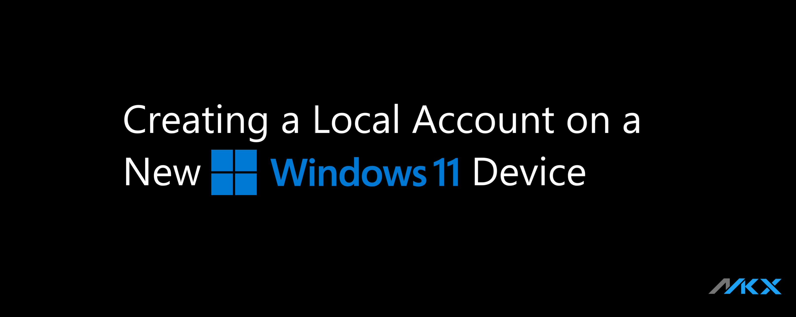

import Video from "@site/src/components/Video";
import BrowserWindow from "@site/src/components/BrowserWindow";
import IframeWindow from '@site/src/components/BrowserWindow/IframeWindow';

<br />

**Getting ready for Windows 11**

In this short article, I’ll share a simple Windows command that can be useful when setting up your **Windows 11-ready device**.




<!-- truncate -->


:::caution[End of Support for Window 10]

Microsoft will officially [end support for Windows 10 on October 14, 2025](https://support.microsoft.com/en-us/windows/windows-10-support-ends-on-october-14-2025-2ca8b313-1946-43d3-b55c-2b95b107f281). As organizations and individuals prepare to upgrade to Windows 11, many are looking for ways to maintain control over their setup — especially when it comes to user accounts.

:::


## ```start ms-cxh:localonly```

This command launches certain Microsoft apps in local-only mode, preventing them from connecting to the internet or syncing with cloud services. It’s a handy trick for creating a local account during Windows 11 setup.


### Why Use a Local Account?

Some environments benefit from keeping things offline:

- Schools – Simplified device management
- Kiosks – No need for cloud integration
- Legacy setups – Maintain traditional workflows
- Privacy-conscious users – Avoid unnecessary data sharing


### How to use

When setting up a new Windows 11 PC, Microsoft usually asks you to sign in with a Microsoft account. But what if you want to create a local account instead?

Here’s a trick that might work:

1. During setup, press **Shift + F10** to open Command Prompt.

1. Type

    ```sh
    start ms-cxh:localonly
    ```

    

1. This may trigger a local-only experience, depending on your Windows build.
1. You can then follow prompts to create a local user account without signing in online.

    :::tip[Note]

    This method may not work on all builds. Microsoft has been tightening restrictions, but it remains effective in many enterprise and education scenarios.

    :::


## Final Thoughts

As Windows 11 becomes the new standard, knowing how to create a local account gives you more flexibility and control. Whether you're setting up devices for a school, business, or personal use, this command can help you stay local — and stay in charge.
