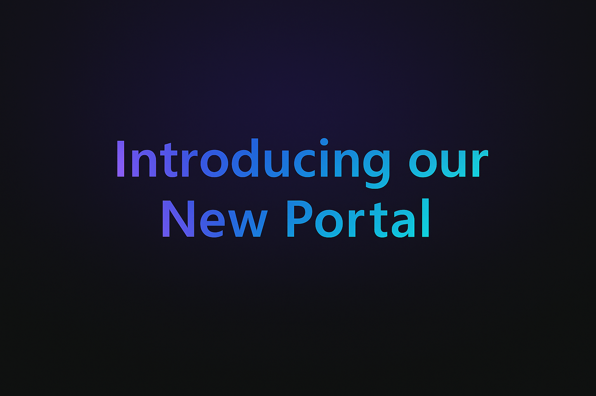

**New Portal is here!**

I'm happy to announce that the new portal for teams under the SpaceHub Project is now **LIVE!**.

{/* truncate */}

Designed to support seamless collaboration, [this new portal](https://kitimi.atlassian.net/servicedesk) is a centralized digital workspace for project updates, shared resources, and key communications.

## What's Inside

- A central place for SpaceHub project info
- Quick access to updates and resources
- A cleaner, more streamlined experience

## Get started

1. Navigate to [kitimi.atlassian.net/servicedesk](https://kitimi.atlassian.net/servicedesk)
2. Sign in using your valid credentials
3. If you are a new user, follow the on‑screen sign‑up process and complete MFA setup

:::caution[IMPORTANT]

Access is limited to eligible internal teams. If you experience access issues, contact your manager.

:::

## FAQs {/* #faqs*/}

What is the SpaceHub Portal?

The SpaceHub Portal is a centralized hub for SpaceHub Project members to access resources, updates, collaboration tools, and submit incidents or service requests.

How do I get access to the portal?

Access is provided to various teams working actively with the SpaceHub Project. If you believe you should have access or are experiencing issues, please contact your manager for assistance.

How do I report an incident or submit a request?

Use the request options available in the portal to submit incidents or service requests. Each request will be tracked through resolution.

Is the portal available on mobile devices?

Yes. The SpaceHub Portal can be accessed through a modern web browser on desktop or mobile devices.

Will other Kitiplex projects have access to this portal?

Right now, the portal is available for teams working with the SpaceHub Project. Access for other teams may may be introduced later.

