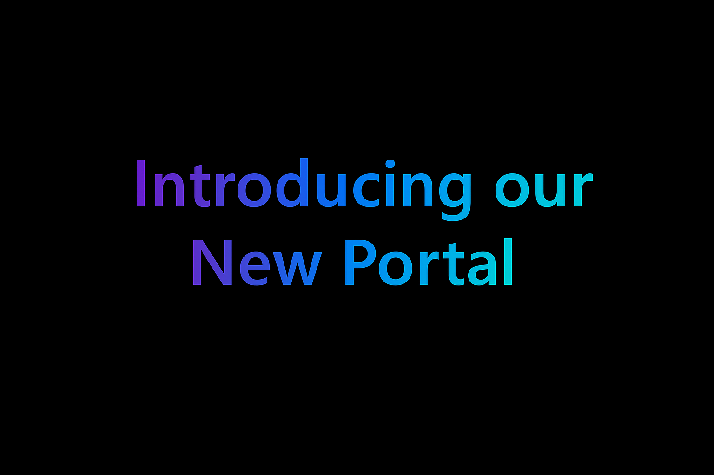

**Introducing our New Portal**

We’re excited to announce that the new Portal is officially available for all SpaceHub Project members!

{/* truncate */}

Members of the SpaceHub Project at Kitiplex can now access the portal—a central hub for project resources, updates, collaboration tools, and reporting incidents or creating requests.

## What's Inside

- A central place for SpaceHub project info
- Quick access to updates and resources
- A cleaner, more streamlined experience

## Get started

1. Navigate to [kitimi.atlassian.net/servicedesk](https://kitimi.atlassian.net/servicedesk)
2. Enter your valid credentials.
3. For new users, follow the signup process. Make sure to have your MFA app in handy!

## FAQs {/* #faqs*/}

Who can access?

Access is available to various teams working actively on SpaceHub Project Kitiplex. 

How do I get access to the portal?

Access is provided to SpaceHub Project members by invitation. If you believe you should have access or are experiencing issues, please contact your manager for assistance.

How do I report an incident or submit a request?

Use the request options available in the portal to submit incidents or service requests. Each request will be tracked through resolution.

Will other Kitiplex projects have access to this portal?

Right now, the portal is available for teams working with the SpaceHub Project. Access for other teams may may be introduced later.

