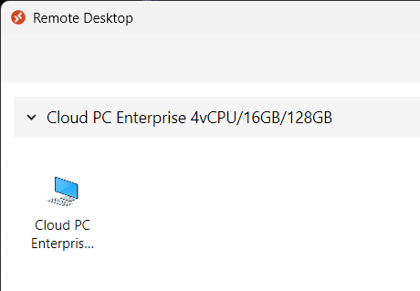
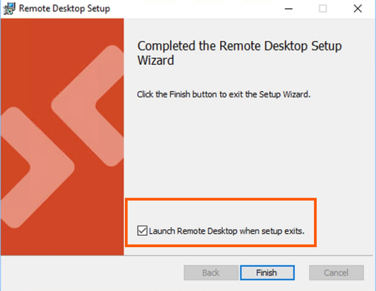
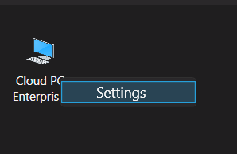
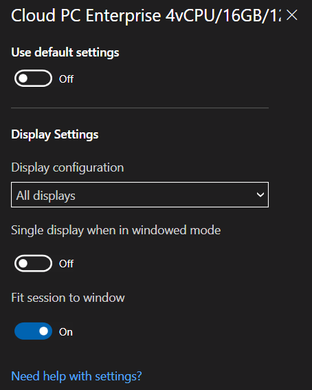
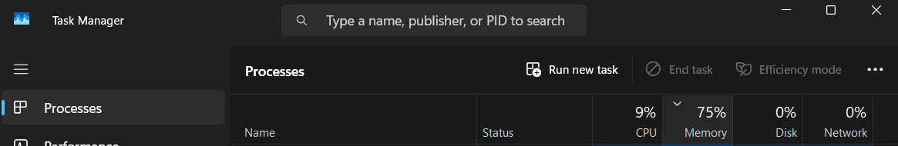
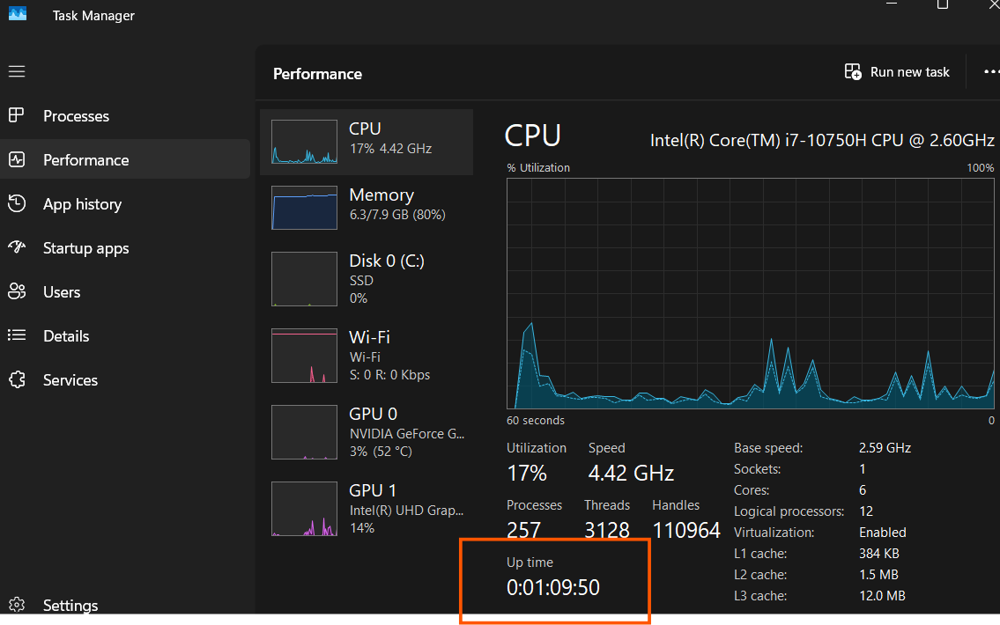

import CloudPC from '@site/static/img/logo/cloud-pc.svg';
import Tabs from '@theme/Tabs';
import TabItem from '@theme/TabItem';
import BrowserWindow from '@site/src/components/BrowserWindow';

**Hello there!**

This article outlines basic functions and how to fix common issues in Cloud PC.

<CloudPC className="logoBadge" />

{/* truncate */}

## Cloud vs Remote {#cloud-vs-remote}
<!-- > How are they different? -->

- **Cloud PC** is a virtual machine providing users with a rich Windows Desktop experience hosted in the Windows365 services.
- **Remote Desktop/Cloud PC Client** is a tool for accessing your Cloud PC from anywhere using another device.

## How to Access

Visit [windows365.microsoft.com](https://windows365.microsoft.com) to see remote desktop that your admin has made available to you. If you get an error similar to "subscription and/or license", reach out your manager to ask and confirm whether your employment package comes with the **Cloud PC license**.

:::tip[keep in mind]

**Admins don't manually create Cloud PCs**. Cloud PCs are created automatically by the Windows 365 service when an appropriate license is assigned.
:::

## How to Install

Login to [windows365.microsoft.com](https://windows365.microsoft.com) > Navigate to Downloads > Choose the system type (64/32) in the dropdown. If you don't know what your system type, click to "what's my os" button bellow.

  <a class="button button--outline button--primary" href="ms-settings:about" target="_blank"><FAIcon icon="fa-brands fa-windows"/> What's My OS</a>

  

Perform a normal installation, follow the prompts and put a "check" at before hitting "finish".

:::caution[it's asking for admin]

Our support may be limited for **personal devices** as this is beyond our scope. However, you can either contact the owner or reset the device.

:::

## Setup
Once installed, open the Remote Desktop client, and hit **Subscribe** and enter your login credentials.Once finished, your workspaces are displayed in the Remote Desktop application.

## Recommended Settings 

Before connecting to Remote Desktop for the first time, we recommend turning off the “Use default settings” option. To do this, right-click the Remote Desktop icon and select Settings.

## Troubleshooting

Cloud PCs works like physical devices and may encounter issues such as connectivity problems, slow performance, and software compatibility.

### User Actions
The table below describes important actions you can  perform as basic troubleshooting. Login to [windows365.microsoft.com](https://windows365.microsoft.com) using your account. 

| Action               | Description                                                                                   |
|----------------------|-----------------------------------------------------------------------------------------------|
| **Restart**          | Clears temporary files and refreshes resources, which can enhance performance and apply updates. |
| **Troubleshoot**     | Checks for connection issues, ensuring necessary files or agents are installed.              |
| **System Info**      | Displays specifications of your Cloud PC.                                                   |

### Connectivity
If connecting is an issue, consider trying these steps:

- **Check Your Internet:** Ensure your [internet is stable](https://speedtest.net/run) and functioning properly.
- **Check Your Cables:** You might want to check if those cables are properly connected with no physical damage.
- **Restart the App:** Closing and reopening the Cloud PC app or your browser can sometimes help.
- **Clear Your Browser Cache:** If you’re using a browser, clearing cache and cookies might resolve the issue.

### Performance
For a sluggish Cloud PC, here are some things to think about:

- **Close Extra Apps:** Reducing the number of open applications can improve performance.
- **Check Resource Usage:** Look at your [CPU and memory usage](#check-uptime) to identify any resource-heavy apps.
- **Restart Your Cloud PC:** A quick restart can refresh the system and boost speed.

### Audio and video
For connections using the Remote Desktop client for Windows to access Cloud PCs, the first time you sign in to your Cloud PC, Microsoft Teams will be installed.

After the installation, the optimizations to redirect audio and video to your local Windows endpoint don’t work. You must close Teams and sign out from or restart the Cloud PC to activate the Optimized status.

## Pro Tips

### Stay Updated
Keeping your system and applications updated ensures you have the latest features and security. If there’s a green arrow on your Cloud PC client, it indicates updates are available.

### Close those Extra Apps
Reducing the number of open applications can improve performance. You can check what app consumes most `memory/RAM` via task manager (CTRL + shift + Esc).

### Check Uptime
This applies to both Cloud and local PCs. You can check how long your Cloud PC has been running in Task Manager (Ctrl + Shift + Esc) under the "Performance" tab, displayed as [DAYS: HOURS: MINUTES: SECONDS]. Regular restarts, ideally **once a week**, can keep things running smoothly.

## Something Missing?
If you have suggestions for improvement or ran into issues:

<Columns className='item margin-bottom-lg' > 

<Column  className='text--left item  padding--sm'>
<Card shadow='tl'  style={{border: '1.5px solid var(--ifm-color-primary)', height:'100%'}}>
    <CardHeader>
      <h3>For Developers 🚀</h3>
    </CardHeader>
    <CardBody>
      Report those pesky bugs and become a contributor of this project! [Take me there](/community/issue/report).
    </CardBody>
  </Card>
</Column>

<Column  className='text--left item  padding--sm'>
<Card shadow='tl'style={{border: '1.5px solid var(--ifm-color-primary)', height:'100%'}}>
    <CardHeader>
      <h3>Direct Contact💡</h3>
    </CardHeader>
    <CardBody>
      If we share the same workplace, you can reach out to me directly via MS Teams.
    </CardBody>
  </Card>
</Column>

</Columns>