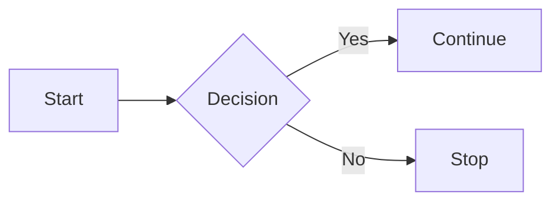

 ## Status

|   | **Definition** | **Example** |
| --- | --- | --- |
| **New** | Unassigned tickets that requires triage | ~|
| **Assigned** | Work in-progress and assigned to the appropriate team. | ~ |
| **Awaiting Approval** | The ticket is complete but needs formal approval before finalization. | A new feature request is pending the product manager’s approval. |
| **Need Info** | The ticket is paused pending additional information from the requester. | A customer’s billing issue requires more details to resolve. |
| **On-Hold** | The ticket is temporarily paused due to external factors. | A software bug fix is on hold while waiting for a vendor patch. |
| **Escalated** | The ticket is prioritized for faster resolution by a more experienced team. | A critical system failure is escalated to the senior technical team. |
| **Resolved** | The issue is addressed, awaiting confirmation from the requester. | A login issue is fixed by resetting the password, pending customer confirmation. |
| **Closed** | The ticket is fully resolved and finalized. | A file access problem is resolved with a new link, and the ticket is closed after confirmation. |

## Type

|   | **Definition** | **Example** |
| --- | --- | --- |
| **Problem** | Any reported issue that causes work or service disruption that requires investigation and troubleshooting. | ~ |
| **Change Request** | Any in-scope request to modify and/or create a service or process. | User onboarding; Device pheriperals |
| **Feedback** | Similar to feature request are suggestions to enhance or add features to services for better user experience. | A client suggests adding a mobile app feature to track service status. This is logged as a feature request for future development. |

## Priority Level

| ~  | Level  | Description                                                                 | Example Scenario                                                                                         |
|----------|--------|-----------------------------------------------------------------------------|---------------------------------------------------------------------------------------------------------|
| 🔴**P1**   | **Urgent** | Critical issues that require immediate attention to avoid business downtime or significant disruption. | **Example**: A client’s entire network is down, affecting all employees’ ability to work. Immediate intervention is required to restore service. |
| 🟡**P2**   | **High**   | Important issues that impact business operations but do not completely halt services. Requires resolution within a short time frame. | **Example**: A client’s email server is experiencing intermittent outages, impacting communication. While not a complete failure, it requires swift action to restore stability. |
| 🟢**P3**   | **Low**    | Minor issues or maintenance tasks that do not significantly impact business operations and can be addressed in due course. | **Example**: A user reports that their software is running slowly, but it does not prevent them from completing their work. The issue is not urgent and can be scheduled for later resolution. |

P1

<!-- <h3 id="#P1">P1</h3> -->

🔴 **Priority 1 (Critical)** – Urgent/High Impact

The issue causes a complete system outage, severe service degradation, or a critical failure affecting all users or a key business function

- **Examples**:
  - A server is down, and the business can't operate.
  - A core application is inaccessible or not functioning, affecting all users.
  - A security breach or critical vulnerability.
- **Response Time**: Immediate response; resolution within hours (typically 1-4 hours).
- **Action**:
<!-- - **Action**: Escalate to senior technical staff, prioritize above all other tasks, and provide frequent updates. -->

P2

🟡 **Priority 2 (High)** – Major Issue

The issue significantly impacts productivity but doesn’t cause a complete outage. A workaround may exist, but it requires a resolution to restore full functionality.

- **Examples**:
  - A team or department cannot access a specific application or system, limiting their ability to perform work.
  - Performance issues affecting a large group of users (e.g., slow network or database performance).
  - Some functionality of an essential service is degraded (e.g., email access intermittently unavailable).
- **Response Time**: Prompt response (typically within 4-8 hours); resolution within the same business day if possible.
- **Action**: Investigate as a priority, communicate progress regularly, and escalate if necessary.

P3

🟢 **Priority 3 (Low)** – Minor Issue

The issue has minimal impact on productivity and can be addressed in routine support cycles. It’s a non-critical problem that can wait for a resolution without affecting business operations.

- **Examples**:
  - Software or hardware minor glitches (e.g., user-facing issues like a non-critical software bug).
  - Feature requests or enhancements.
  - General troubleshooting or setup support (e.g., password resets, configuration issues).
- **Response Time**: Response within 1 business day; resolution within a few days depending on workload.
- **Action**: Address during regular support cycles, schedule for resolution as needed.

<!--
### **Automatic Notification**:

- When a **Priority 1 (Critical)** ticket is created, an automatic high-priority notification should be sent to the appropriate team or individual to ensure immediate action is taken.
- **Priority 2 (High)** tickets should trigger a prompt notification for quick attention.
- **Priority 3 (Low)** tickets will trigger standard notifications, with a response within the next business day. -->

### **Clear Communication to Users**

Users submitting tickets should be informed of the expected resolution time based on the priority level:

- 🔴 **P1 (Critical)**: "Immediate response within 1-4 hours."
- 🟡 **P2 (High)**: "Response within 4-8 hours; resolution by end of business day."
- 🟢 **P3 (Low)**: "Response within 1 business day; resolution within 2-3 business days depending on workload."

## Flow

