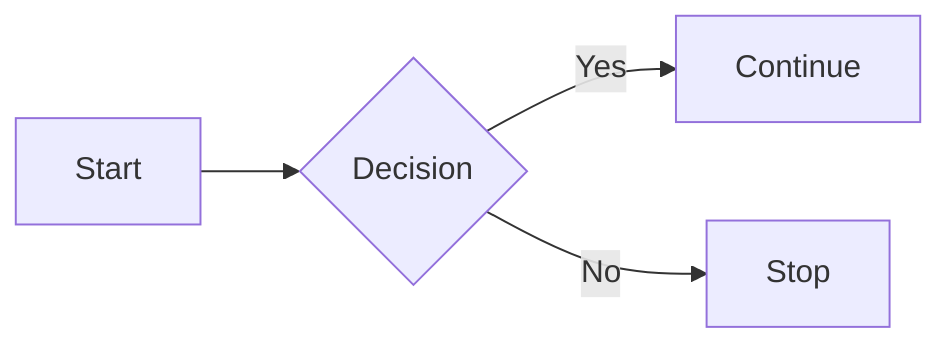
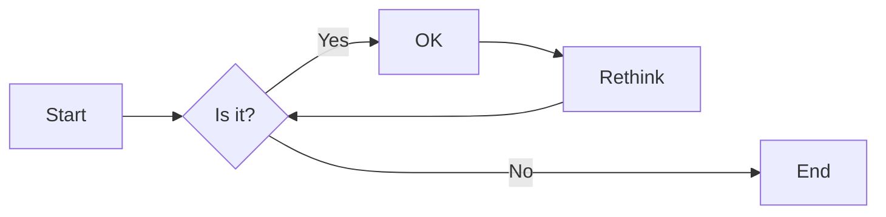

import Tabs from "@theme/Tabs";
import TabItem from "@theme/TabItem";

import Mermaid from '@theme/Mermaid';

# Ticket Priority

This user story outlines the need for prioritizing help desk tickets, ensuring a structured and responsive approach to handling issues based on their urgency and impact.

:::tip[As an IT Support Specialist,] 

I want to categorize incoming tickets into categories based on urgency and impact so that we can prioritize critical issues and allocate resources more effectively, ensuring timely resolution of all tickets.

:::

## Ticket Assessment
When assessing the priority of a ticket, asking probing questions to users is essential to better understand the urgency and impact of the issue.

### **Timeline & History**
- 👉 _When did you first notice this problem?_
- 👉 _When was the last time it worked properly?_
- 👉 _Have there been any changes made before the issue started?_
- 👉 _Is this happening repeatedly?_

### **Troubleshooting & Actions Taken:**
- 👉 _What have you tried so far to fix the issue?_
- 👉 _Did restarting the app or your computer help?_
- 👉 _Have you checked if the problem happens on another device or browser?_
- 👉 _Have you tried clearing the cache or updating the software?_

### **Impact on Work:**
- 👉 _How is this affecting your work?_
- 👉 _Is it preventing you from completing your tasks or meeting any deadlines?_
- 👉 _Can you still do your job, or is it really getting in the way?_
- 👉 _Are you using a backup or different tool to keep working?_

### **Scope of the Issue**
- 👉 _Is anyone else on your team or in your department having the same problem?_
- 👉 _Do you know if others in the company are also affected?_
- 👉 _Is the issue happening on multiple devices or just yours?_
- 👉 _Is this happening everywhere, or just in one location or network?_

## Priority Level Assignment

Each ticket must be assigned one of the following priority levels based on urgency and impact:

P1

<!-- <h3 id="#P1">P1</h3> -->
 🔴 **Priority 1 (Critical)** – Urgent/High Impact

The issue causes a complete system outage, severe service degradation, or a critical failure affecting all users or a key business function

- **Examples**:
  - A server is down, and the business can't operate.
  - A core application is inaccessible or not functioning, affecting all users.
  - A security breach or critical vulnerability.
- **Response Time**: Immediate response; resolution within hours (typically 1-4 hours).
- **Action**: 
<!-- - **Action**: Escalate to senior technical staff, prioritize above all other tasks, and provide frequent updates. -->

P2

🟡 **Priority 2 (High)** – Major Issue

The issue significantly impacts productivity but doesn’t cause a complete outage. A workaround may exist, but it requires a resolution to restore full functionality.
  - **Examples**:
    - A team or department cannot access a specific application or system, limiting their ability to perform work.
    - Performance issues affecting a large group of users (e.g., slow network or database performance).
    - Some functionality of an essential service is degraded (e.g., email access intermittently unavailable).
  - **Response Time**: Prompt response (typically within 4-8 hours); resolution within the same business day if possible.
  - **Action**: Investigate as a priority, communicate progress regularly, and escalate if necessary.

P3

🟢 **Priority 3 (Low)** – Minor Issue

The issue has minimal impact on productivity and can be addressed in routine support cycles. It’s a non-critical problem that can wait for a resolution without affecting business operations.
  - **Examples**:
    - Software or hardware minor glitches (e.g., user-facing issues like a non-critical software bug).
    - Feature requests or enhancements.
    - General troubleshooting or setup support (e.g., password resets, configuration issues).
  - **Response Time**: Response within 1 business day; resolution within a few days depending on workload.
  - **Action**: Address during regular support cycles, schedule for resolution as needed.

<!-- 
### **Automatic Notification**:

- When a **Priority 1 (Critical)** ticket is created, an automatic high-priority notification should be sent to the appropriate team or individual to ensure immediate action is taken.
- **Priority 2 (High)** tickets should trigger a prompt notification for quick attention.
- **Priority 3 (Low)** tickets will trigger standard notifications, with a response within the next business day. -->

### **Clear Communication to Users**

Users submitting tickets should be informed of the expected resolution time based on the priority level:

- 🔴 **P1 (Critical)**: "Immediate response within 1-4 hours."
- 🟡 **P2 (High)**: "Response within 4-8 hours; resolution by end of business day."
- 🟢 **P3 (Low)**: "Response within 1 business day; resolution within 2-3 business days depending on workload."

## Flow

