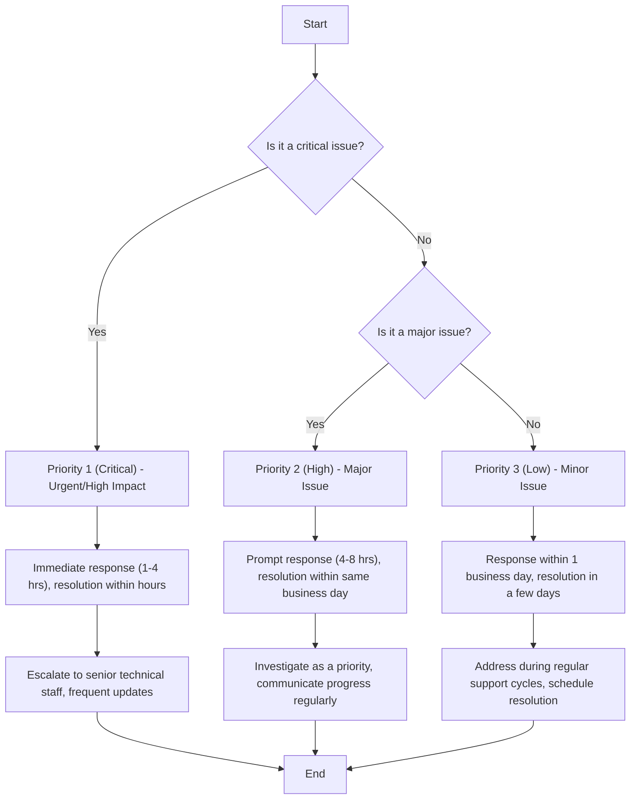

import Mermaid from '@theme/Mermaid';

# Ticket Priority

Categorize Tickets by Priority 1 (Critical), Priority 2 (High), and Priority 3 (Low)

:::tip[objective]
To streamline the process of handling help desk tickets by categorizing them into three priority levels (Low, Medium, High), ensuring critical issues are addressed promptly while managing less urgent requests efficiently. This will improve response times, resource allocation, and overall user satisfaction. 
:::

## Flowchart

<!-- 
## Acceptance Criteria

### **Priority Level Assignment**

Each ticket must be assigned one of the following priority levels based on urgency and impact:

#### **Priority 1 (Critical)** – Urgent/High Impact

  - **Description**: The issue causes a complete system outage, severe service degradation, or a critical failure affecting all users or a key business function.
  - **Examples**:
    - A server is down, and the business can't operate.
    - A core application is inaccessible or not functioning, affecting all users.
    - A security breach or critical vulnerability.
  - **Response Time**: Immediate response; resolution within hours (typically 1-4 hours).
  - **Action**: Escalate to senior technical staff, prioritize above all other tasks, and provide frequent updates.

- **Priority 2 (High)** – Major Issue

  - **Description**: The issue significantly impacts productivity but doesn’t cause a complete outage. A workaround may exist, but it requires a resolution to restore full functionality.
  - **Examples**:
    - A team or department cannot access a specific application or system, limiting their ability to perform work.
    - Performance issues affecting a large group of users (e.g., slow network or database performance).
    - Some functionality of an essential service is degraded (e.g., email access intermittently unavailable).
  - **Response Time**: Prompt response (typically within 4-8 hours); resolution within the same business day if possible.
  - **Action**: Investigate as a priority, communicate progress regularly, and escalate if necessary.

- **Priority 3 (Low)** – Minor Issue
  - **Description**: The issue has minimal impact on productivity and can be addressed in routine support cycles. It’s a non-critical problem that can wait for a resolution without affecting business operations.
  - **Examples**:
    - Software or hardware minor glitches (e.g., user-facing issues like a non-critical software bug).
    - Feature requests or enhancements.
    - General troubleshooting or setup support (e.g., password resets, configuration issues).
  - **Response Time**: Response within 1 business day; resolution within a few days depending on workload.
  - **Action**: Address during regular support cycles, schedule for resolution as needed.

### 2. **Ticket Filtering and Sorting**:

- Tickets must be able to be filtered and sorted by priority level (Priority 1, Priority 2, Priority 3).
- **Priority 1 (Critical)** tickets should be at the top of the queue, followed by **Priority 2 (High)** and **Priority 3 (Low)** tickets.

### 3. **Automatic Notification**:

- When a **Priority 1 (Critical)** ticket is created, an automatic high-priority notification should be sent to the appropriate team or individual to ensure immediate action is taken.
- **Priority 2 (High)** tickets should trigger a prompt notification for quick attention.
- **Priority 3 (Low)** tickets will trigger standard notifications, with a response within the next business day.

### 4. **Clear Communication to Users**:

Users submitting tickets should be informed of the expected resolution time based on the priority level:

- **Priority 1 (Critical)**: "Immediate response within 1-4 hours."
- **Priority 2 (High)**: "Response within 4-8 hours; resolution by end of business day."
- **Priority 3 (Low)**: "Response within 1 business day; resolution within 2-3 business days depending on workload." -->
