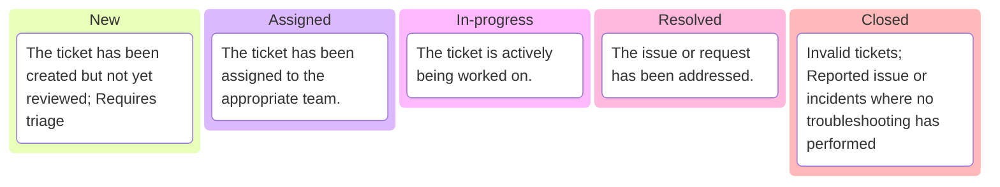

import Tabs from '@theme/Tabs';
import TabItem from '@theme/TabItem';

import Mermaid from '@theme/Mermaid';

# Tickets: Types and Categories

<!-- This user story outlines the need for prioritizing help desk tickets, ensuring a structured and responsive approach to handling issues based on their urgency and impact. -->

:::info[User story/13265s]

**As an IT support specialist**, 

I want to categorize incoming tickets into categories based on urgency and impact so that we can prioritize critical issues and allocate resources more effectively, ensuring timely resolution of all tickets.

**Acceptance criteria**

A clear and concise definition of ticket, [type](#types), [priority](#priority-level), [status](#status).

:::

## Getting started

Similar to the [**Pre-Flight Checklist**](/community/issue/report#pre-flight-checklist), the first step in troubleshooting is to let **end users** describe the problem **clearly and concisely**, rather than just saying **"_it doesn't work_."** 

The following are probing questions to better understand the urgency and impact of the issue:

### History

- 👉 _When did you first notice this problem?_
- 👉 _When was the last time it worked properly?_
- 👉 _Have there been any changes made before the issue started?_
- 👉 _Is this happening repeatedly?_

### Troubleshooting & Actions Taken

- 👉 _What have you tried so far to fix the issue?_
- 👉 _Did restarting the app or your computer help?_
- 👉 _Have you checked if the problem happens on another device or browser?_
- 👉 _Have you tried clearing the cache or updating the software?_

### Impact on Work

- 👉 _How is this affecting your work?_
- 👉 _Is it preventing you from completing your tasks or meeting any deadlines?_
- 👉 _Can you still do your job, or is it really getting in the way?_
- 👉 _Are you using a backup or different tool to keep working?_

### **Scope of the Issue**

- 👉 _Is anyone else on your team or in your department having the same problem?_
- 👉 _Do you know if others in the company are also affected?_
- 👉 _Is the issue happening on multiple devices or just yours?_
- 👉 _Is this happening everywhere, or just in one location or network?_

## Types
The nature of the issue or request, allowing for better organization and prioritization.

|   | **Definition** | **Example** |
| --- | --- | --- |
| **Incident** | An unplanned interruption to an IT Service | A user cannot log in to their account; Company Portal is Down; D1 is Down
| **Problem** | The underlying or root cause of one or more reported incidents. | Recurring network outages; Frequent app crash |
| **Change Request (CR)** | A request or proposal a change to IT services. | Software upgrades; Third-party software installation; |
| **Service Request (SR)** | Could be a request for information; Standard change, or an access to an IT service. | User onboarding; Specific site access; Password reset; Quarantined Email Release |

## Status
The current state or stage of a ticket within its lifecycle.

<!-- 

|   | **Definition** |
| --- | --- | 
| **New** | Unassigned tickets that requires triage | ~|
| **Assigned** | Work in-progress and assigned to the appropriate team. | 
| **In progress** | The ticket is complete but needs formal approval before finalization. |
| **Resolved** | The issue is addressed, awaiting confirmation from the requester. | 
| **Closed** | The ticket is fully resolved and finalized. |  -->

## Priority Level

| ~  | Level  | Description                                                                 | Example Scenario                                                                                         |
|----------|--------|-----------------------------------------------------------------------------|---------------------------------------------------------------------------------------------------------|
| 🔴**P1**   | **Urgent** | Critical issues that require immediate attention to avoid business downtime or significant disruption. | **Example**: A client’s entire network is down, affecting all employees’ ability to work. Immediate intervention is required to restore service. |
| 🟡**P2**   | **High**   | Important issues that impact business operations but do not completely halt services. Requires resolution within a short time frame. | **Example**: A client’s email server is experiencing intermittent outages, impacting communication. While not a complete failure, it requires swift action to restore stability. |
| 🟢**P3**   | **Low**    | Minor issues or maintenance tasks that do not significantly impact business operations and can be addressed in due course. | **Example**: A user reports that their software is running slowly, but it does not prevent them from completing their work. The issue is not urgent and can be scheduled for later resolution. |

