import Tabs from '@theme/Tabs';
import TabItem from '@theme/TabItem';

## What is Global Secure Access?
Global Secure Access (GSA) is a Microsoft solution that helps keep your organization’s network safe when employees connect from anywhere. It combines three things:

- Identity (who you are),
- Device security (is your device trusted?),
- Network access (what resources you can reach).

This article outlines how to deploy Global Secure Access (GSA) with Intune and install it silently on Windows devices.


## Prerequisite

- Microsoft Entra environment with Global Secure Access enabled.
- Devices must be Entra joined or hybrid joined
- Administrative role: [GSA Administrator](https://learn.microsoft.com/en-us/entra/global-secure-access/reference-role-based-permissions#role-based-permissions) in Entra.
- Access to Intune
- GSA client installer
- Packaging tool
- Security Group (Device or Users)

## Download the GSA Client

1. Sign in to the Microsoft Entra admin center.
2. Navigate to Global Secure Access > Connect > Client Download.

    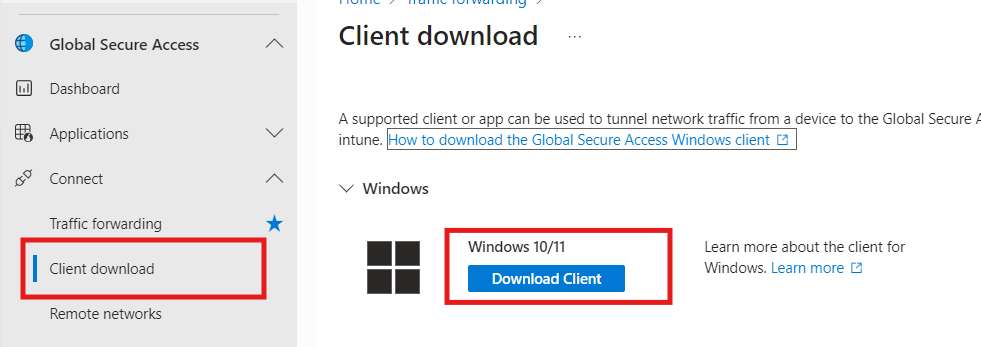

## Prepare the Installer

<!-- Download `IntuneWinAppUtil.exe` from [GitHub](https://github.com/microsoft/Microsoft-Win32-Content-Prep-Tool) and convert the Windows client (`.exe`) to `.intunewin` format: -->

1. Download the `IntuneWinAppUtil.exe` [GitHub](https://github.com/microsoft/Microsoft-Win32-Content-Prep-Tool).

    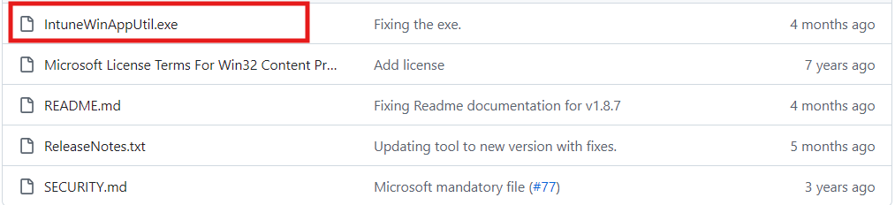
    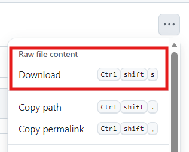

1. Copy the script below and save it as `.ps1` file.
    
    <details>
    <summary>PowerShell</summary>

    ```powershell showLineNumbers title="GlobalSecureAccessClient.ps1"
    # Create log directory and log helper
    $logFile = "$env:ProgramData\GSAInstall\install.log"
    New-Item -ItemType Directory -Path (Split-Path $logFile) -Force |   Out-Null

    function Write-Log {
        param([string]$message)
        $timestamp = Get-Date -Format "yyyy-MM-dd HH:mm:ss"
        Add-Content -Path $logFile -Value "$timestamp - $message"
    }

    try {
        $ErrorActionPreference = 'Stop'
        Write-Log "Starting Global Secure Access client installation."

    # IPv4 preferred via DisabledComponents registry value
        $ipv4RegPath    =   "HKLM:\SYSTEM\CurrentControlSet\Services\Tcpip6\Parameters"
        $ipv4RegName    = "DisabledComponents"
        $ipv4RegValue   = 0x20  # Prefer IPv4 over IPv6
        $rebootRequired = $false

    # Ensure the key exists
        if (-not (Test-Path $ipv4RegPath)) {
            New-Item -Path $ipv4RegPath -Force | Out-Null
            Write-Log "Created registry key: $ipv4RegPath"
        }

    # Get current value if present
        $existingValue = $null
        $valueExists = $false
        try {
            $existingValue = Get-ItemPropertyValue -Path $ipv4RegPath   -Name $ipv4RegName -ErrorAction Stop
            $valueExists = $true
        } catch {
            $valueExists = $false
        }

    # Determine if we must change it
        $expected = [int]$ipv4RegValue
        $needsChange = -not $valueExists -or ([int]$existingValue -ne   $expected)

    if ($needsChange) {
            if (-not $valueExists) {
                # Create as DWORD when missing
                New-ItemProperty -Path $ipv4RegPath -Name $ipv4RegName  -PropertyType DWord -Value $expected -Force | Out-Null
                Write-Log ("IPv4Preferred value missing. Created '{0}'  with value 0x{1} (dec {2})." -f $ipv4RegName, ([Convert] ::ToString($expected,16)), $expected)
            } else {
                # Update if different
                Set-ItemProperty -Path $ipv4RegPath -Name $ipv4RegName  -Value $expected
                Write-Log ("IPv4Preferred value differed. Updated '{0}'     from 0x{1} (dec {2}) to 0x{3} (dec {4})." -f    $ipv4RegName, ([Convert]::ToString([int]$existingValue,    16)), [int]$existingValue, ([Convert]::ToString ($expected,16)), $expected)
            }
            $rebootRequired = $true
        } else {
            Write-Log ("IPv4Preferred already set correctly: {0}=0x{1}  (dec {2}). No change." -f $ipv4RegName, ([Convert]::ToString ($expected,16)), $expected)
        }

    # Resolve installer path
        $ScriptRoot = if ($PSScriptRoot) { $PSScriptRoot } else {   Split-Path -Parent $MyInvocation.MyCommand.Path }
        $installerPath = Join-Path -Path $ScriptRoot -ChildPath     "GlobalSecureAccessClient.exe"
        Write-Log "Running installer from $installerPath"

    if (Test-Path $installerPath) {
            $installProcess = Start-Process -FilePath $installerPath    -ArgumentList "/quiet" -Wait -PassThru

    if ($installProcess.ExitCode -eq 1618) {
                Write-Log "Another installation is in progress. Exiting     with code 1618."
                exit 1618
            } elseif ($installProcess.ExitCode -ne 0) {
                Write-Log "Installer exited with code $($installProcess.    ExitCode)."
                exit $installProcess.ExitCode
            }

    Write-Log "Installer completed successfully."
        } else {
            Write-Log "Installer not found at $installerPath"
            exit 1
        }

    if ($rebootRequired) {
            Write-Log "Reboot required due to registry value creation   or update."
            exit 3010  # Soft reboot required
        } else {
            Write-Log "Installation complete. No reboot required."
            exit 0
        }
    }
    catch {
        Write-Log "Fatal error: $_"
        exit 1603
    }
    ```
    </details>

    :::security[important]

    The Global Secure Access client and the PowerShell script must have     the same filename and be located in the same directory on your  machine. For example:

    - `GlobalSecureAccessClient.ps1`
    - `GlobalSecureAccessClient.exe`

    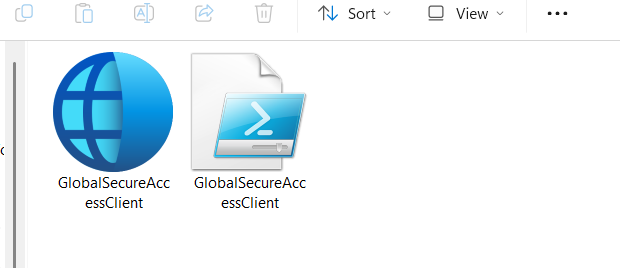

    :::


1. Run the `IntuneWinAppUtil.exe` and follow the prompt:


    <!-- <pre>
      <b>Please specify the source: </b>C:\Users\Keith\Desktop\WindowGSAInstaller
      <b>Please specify the setup file: </b>GlobalSecureAccessClient.ps1
      <b>Please specify the output folder: </b>C:\Users\Keith\Desktop\WindowGSAInstaller
      <b>Do you want to specify catalog folder (Y/N): </b>N
    </pre> -->

    
    ```jsx
    Please specify the source folder: C:\Users\Keith\Desktop\WindowGSAInstaller
    Please specify the setup file: GlobalSecureAccessClient.ps1
    Please specify the output folder: C:\Users\Keith\Desktop\WindowGSAInstaller
    Do you want to specify catalog folder: N
    ```

## Deploy GSA with Intune

1. Navigate to Intune Admin Center
1. Select Apps > Windows > Create.
1. On the Select app type pane.
1. Under the **Select app types** > choose Windows app (Win32) and click Select.
    
    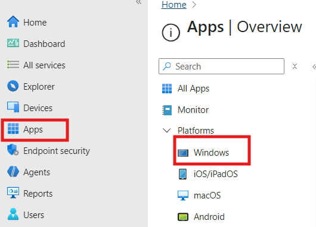
    

1. Click Select app package file option.
1. Click the blue folder to upload the `.intunewin` file


    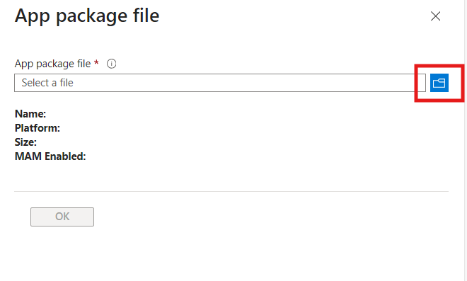

1. Complete the following steps:

    - Fill in the details on the app informantion.

        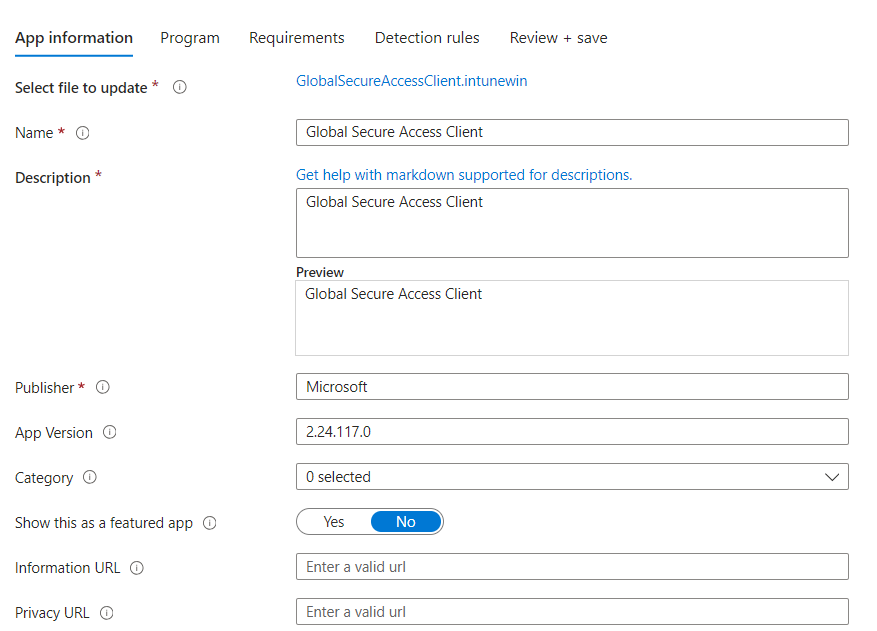

    - Specify install/uninstall commands.

        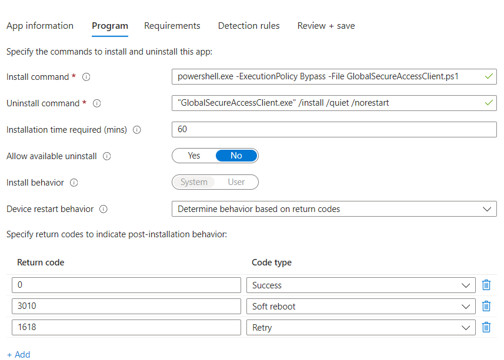

    - Define OS and architecture

        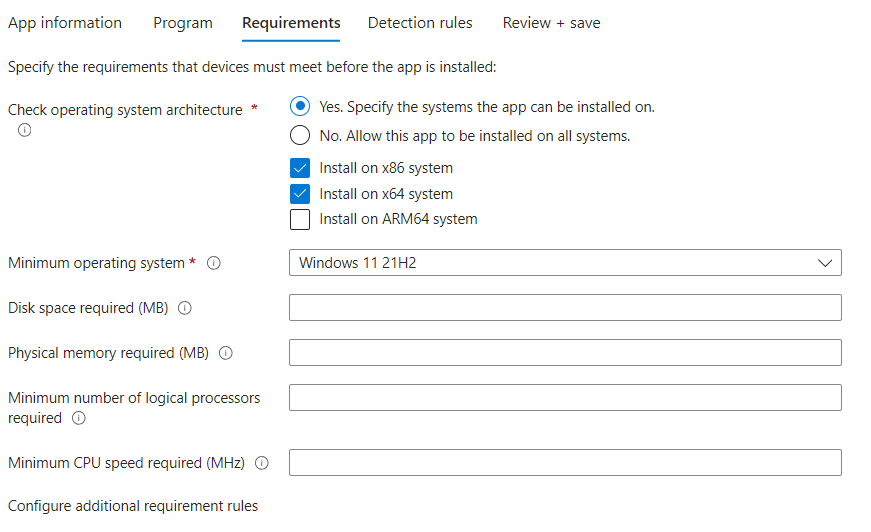

    - Configure detection rule appropriately

        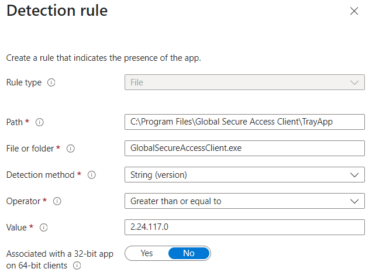

1. Click OK, then Next twice to reach Assignments
1. Under Required click +Add group. Select a group of users or devices and click Select.
1. Click Next. Click Create.


## Monitor Installation

Check deployment status via Intune Admin Center:

- Go to Windows apps list, find the deployed app
- Use the **Monitor** dropdown for status options.

When Installation Is Successful

Taskbar 

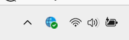

GSA User Interface
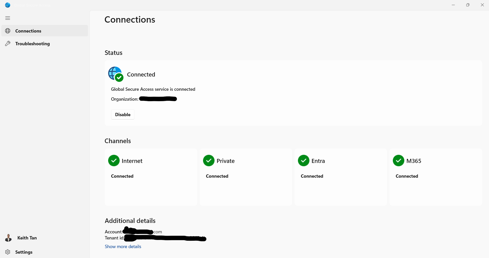


## Learn more

- [Package Script](https://learn.microsoft.com/en-us/entra/global-secure-access/how-to-install-windows-client#package-the-client)
- [aka.ms/GlobalSecureAccess-Windows](http://aka.ms/GlobalSecureAccess-Windows)
- [GSA Known Issues](https://microsoft.github.io/GlobalSecureAccess/Troubleshooting/KnownIssues)
