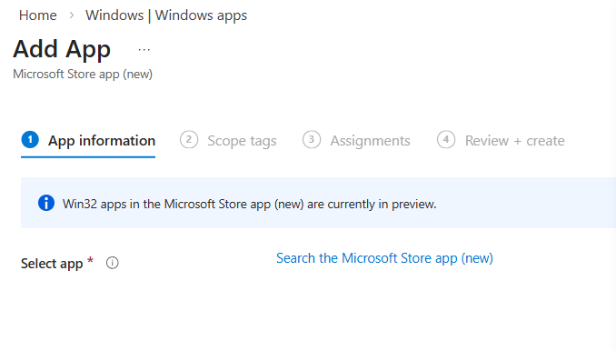
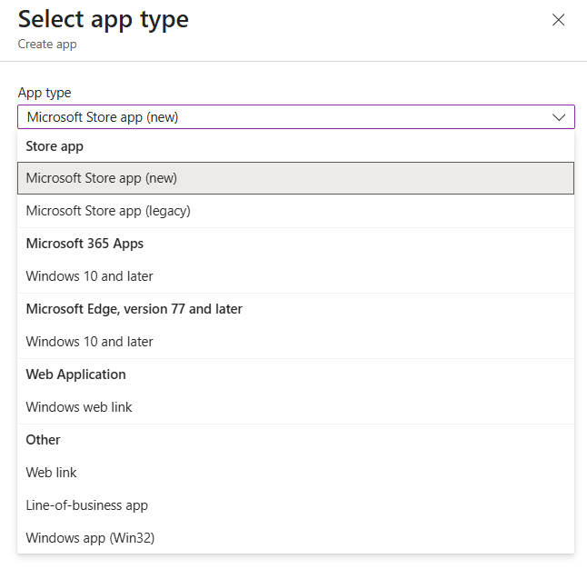
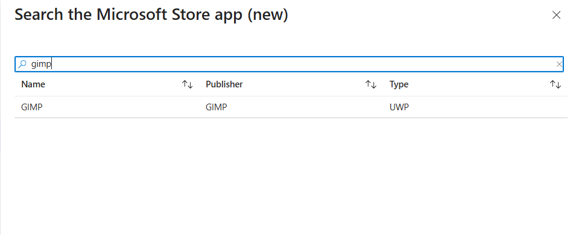

import ComingSoon from '@site/src/components/ComingSoon';
import MSIntune from '@site/static/img/logo/Microsoft-intune.svg';

This guide outlines steps for deploying Microsoft Store apps (new) through Microsoft Intune. This method uses the modern Windows Package Manager (WinGet) for reliable, automatically updated app installations on Windows devices.

What's New

Microsoft has retired the Microsoft Store for Business. Intune now supports a new method for deploying Store apps via the **Microsoft Store app (new)** option. This allows IT admins to search, assign, and automatically update apps directly from the Intune admin center.

- **Automatic updates**: Apps stay current without manual repackaging.
- **Supports multiple formats**: UWP, MSIX, and Win32 (.exe/.msi).
- **Simplified deployment**: No need for Store for Business integration.

## Prerequisites

- Intune Admin or Application Admin role
- Devices must be **Windows 10/11** and enrolled in Intune.
- Microsoft Store access must be enabled.
- **ARM64 installers are not supported** via this method.

:::tip

In this article, we'll choose [**GIMP**](https://www.gimp.org/) as an example however, you can choose any supported app depending on your requirements.

:::

## Get started

### 1. Go to [Intune Admin Center](https://intune.microsoft.com)
Navigate to **Apps → All apps → Add**. 

### 2. Select App Type
Choose **Microsoft Store app (new)** from the dropdown. 

### 3. Search and Select the App

Use the built-in search to find the app.
Click **Select** to add it. 

### 4. Configure App Info
Intune automatically fills in details like:

- App name
- Publisher
- Description
- Package identifier

Make changes if needed, then select **Next**.

### 5. Set Deployment Options

Choose how the app is deployed:

- **Required** – Auto‑install
- **Available for enrolled devices** – User‑install via Company Portal
- **Uninstall** – Remove the app

Click **Next**.

### 6. Save and Deploy

Confirm settings and deploy the app. Intune will deploy the app on the next device sync.

### 7. Monitor Installation

Go to **Monitor → App install status** to track progress.

## FAQ

- **Q: Do I need to re-add apps from the old Store for Business?**
- **A:** Yes, migrate them using the new method in Intune.
- **Q: Will apps update automatically?**
- **A:** Yes, Intune handles updates without admin action.
- **Q: Where do users find available apps?**
- **A:** In the **Company Portal**.

More about [adding apps via Intune](https://learn.microsoft.com/en-us/intune/intune-service/apps/apps-add)
