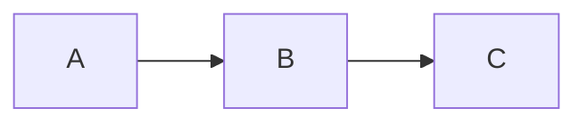
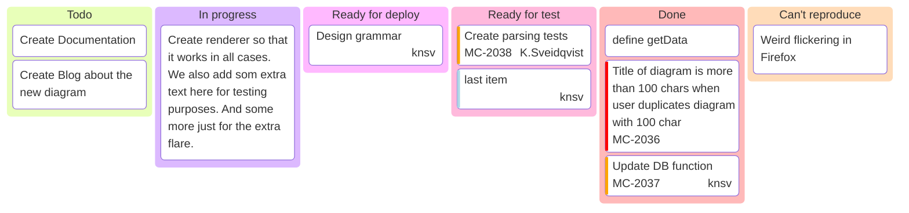

import Tabs from '@theme/Tabs';
import TabItem from '@theme/TabItem';
import IframeWindow from '@site/src/components/BrowserWindow/IframeWindow';
import Video from '@site/src/components/Video';
import BrowserWindow from '@site/src/components/BrowserWindow';
import useBaseUrl from '@docusaurus/useBaseUrl';

<br />


### What's this?

The official docs website of **The SpaceHub Project** maintained by the [Kitiplex Core Engineering Team](https://github.com/kitiplex) - featuring basic code samples and snippets for web development as well as practical guides for system administration specifically on the Microsoft 365 and Entra ID environment.

### Motivation

The project started as enhancement proposal that requires project owners to include a title and a short description on their `README.md` file prior initializing their repos making it a standard practice in respect to [Software Development Lifecycle (SDLC)](https://github.com/resources/articles/software-development/what-is-sdlc#sdlc-best-practices-and-challenges).

### Features

The project is built on top of [Docusaurus](https://docusaurus.io) - a modern and flexible documentation framework allowing developers:

- Customize their website using `React` components;
- Extend features using plugins;
- Easily deploy to [GitHub Pages](https://docs.github.com/en/pages/getting-started-with-github-pages/configuring-a-publishing-source-for-your-github-pages-site), [Netlify](https://www.netlify.com/with/react/), [Vercel](https://vercel.com/new), [Cloudflare](https://pages.cloudflare.com/) and many more.

<BrowserWindow>

<Tabs>
<TabItem value="sh" label="PowerShell">

```sh
Restart-Computer -Force
```

</TabItem>

<TabItem value="py" label="Python">

```py
import this
```

</TabItem>
<TabItem value="git" label="Git">

```bash
git add --all && git commit -m "refactor doc structure"
```

</TabItem>
</Tabs>

</BrowserWindow>

<!-- <BrowserWindow>


</BrowserWindow> -->

<details>
<summary>Math Rendering</summary>

For displaying complex equations

- $ E = mc^2 $
- $ F = ma $
- $ I = \int_0^{2\pi} \sin(x)\,dx $

</details>

<details>
<summary>Diagrams</summary>

For clear visual explanations





</details>

### Explore

<Columns className='item margin-bottom-lg'>

<Column className="text--left item  padding--sm">
  <Card
    shadow="tl"
    style={{ border: "1.5px solid var(--ifm-color-primary)", height: "100%" }}>
    <CardHeader>
      <h3>
        <a href="/docs/system-administration/ms-entra/create-dynamic-group">Create a Dynamic Group</a>
      </h3>
    </CardHeader>
    <CardBody>A quick guide to creating a dynamic group in Entra ID.</CardBody>
  </Card>
</Column>

<Column className="text--left item  padding--sm">
  <Card
    shadow="tl"
    style={{ border: "1.5px solid var(--ifm-color-primary)", height: "100%" }}
  >
    <CardHeader>
      <h3>
        <a href="/cosmos/solar-system/moons/phases-of-the-moon">Moon Phases</a>
      </h3>
    </CardHeader>
    <CardBody>
    Discover stuff about our solar system starting with our Moon.
    </CardBody>
  </Card>
</Column>
</Columns>

<br />


