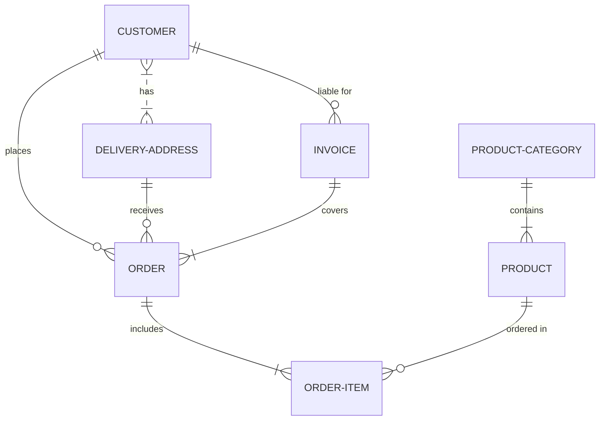
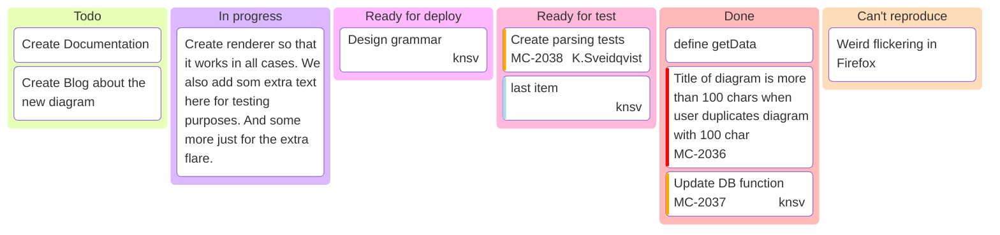

# MDX Features

import Video from "/src/components/Video";
import IframeWindow from '@site/src/components/BrowserWindow/IframeWindow';
import BrowserWindow from '@site/src/components/BrowserWindow';
import {useLocation} from '@docusaurus/router';

import CodeBlock from '@theme/CodeBlock';
import MyComponentSource from '!!raw-loader!/docusaurus.config.ts';


<Card>
    <CardHeader
      className='padding-top--lg'
      style={{ backgroundColor: 'rgb(33 126 209)' , color:'black'}}
    >
      <div className='avatar avatar--vertical'>
        
        <div className='avatar__intro'>
          <div className='avatar__name'>Welcome</div>
          <span className='avatar__subtitle'>
            <!-- <a style={{ color:'white'}} href='https://mkeithx.pages.dev/'>The SpaceHub Project</a> -->
            <p style={{ color:'white'}}>Playground for extending APIs and extra plugin instances for testing / dogfooding purposes.</p>
          </span>
        </div>
      </div>
</CardHeader>
</Card>

## Quick Links

- [http://localhost:3000/__docusaurus/debug](http://localhost:3000/__docusaurus/debug)


- [pathname:///pure-html](pathname:///pure-html)

- http://localhost:3000/tests/example

## Site Configurations

>### `docusaurus.config.ts`

<details>
<summary>Current</summary>

<CodeBlock language="ts">{MyComponentSource}</CodeBlock> 

</details>

### Config

> `docusaurus.config.ts`

<details>
<summary><code>docusaurus.config.ts</code></summary>

```ts showLineNumbers
import {themes as prismThemes} from 'prism-react-renderer';
import type {Config} from '@docusaurus/types';
import type * as Preset from '@docusaurus/preset-classic';

const config: Config = {
  title: 'My Site',
  tagline: 'Dinosaurs are cool',
  favicon: 'img/favicon.ico',

  // Set the production url of your site here
  url: 'https://your-docusaurus-site.example.com',
  // Set the /<baseUrl>/ pathname under which your site is served
  // For GitHub pages deployment, it is often '/<projectName>/'
  baseUrl: '/',

  // GitHub pages deployment config.
  // If you aren't using GitHub pages, you don't need these.
  organizationName: 'facebook', // Usually your GitHub org/user name.
  projectName: 'docusaurus', // Usually your repo name.

  onBrokenLinks: 'throw',
  onBrokenMarkdownLinks: 'warn',

  // Even if you don't use internationalization, you can use this field to set
  // useful metadata like html lang. For example, if your site is Chinese, you
  // may want to replace "en" with "zh-Hans".
  i18n: {
    defaultLocale: 'en',
    locales: ['en'],
  },

  presets: [
    [
      'classic',
      {
        docs: {
          sidebarPath: './sidebars.ts',
          // Please change this to your repo.
          // Remove this to remove the "edit this page" links.
          editUrl:
            'https://github.com/facebook/docusaurus/tree/main/packages/create-docusaurus/templates/shared/',
        },
        blog: {
          showReadingTime: true,
          feedOptions: {
            type: ['rss', 'atom'],
            xslt: true,
          },
          // Please change this to your repo.
          // Remove this to remove the "edit this page" links.
          editUrl:
            'https://github.com/facebook/docusaurus/tree/main/packages/create-docusaurus/templates/shared/',
          // Useful options to enforce blogging best practices
          onInlineTags: 'warn',
          onInlineAuthors: 'warn',
          onUntruncatedBlogPosts: 'warn',
        },
        theme: {
          customCss: './src/css/custom.css',
        },
      } satisfies Preset.Options,
    ],
  ],

  themeConfig: {
    // Replace with your project's social card
    image: 'img/docusaurus-social-card.jpg',
    navbar: {
      title: 'My Site',
      logo: {
        alt: 'My Site Logo',
        src: 'img/logo.svg',
      },
      items: [
        {
          type: 'docSidebar',
          sidebarId: 'tutorialSidebar',
          position: 'left',
          label: 'Tutorial',
        },
        {to: '/blog', label: 'Blog', position: 'left'},
        {
          href: 'https://github.com/facebook/docusaurus',
          label: 'GitHub',
          position: 'right',
        },
      ],
    },
    footer: {
      style: 'dark',
      links: [
        {
          title: 'Docs',
          items: [
            {
              label: 'Tutorial',
              to: '/docs/intro',
            },
          ],
        },
        {
          title: 'Community',
          items: [
            {
              label: 'Stack Overflow',
              href: 'https://stackoverflow.com/questions/tagged/docusaurus',
            },
            {
              label: 'Discord',
              href: 'https://discordapp.com/invite/docusaurus',
            },
            {
              label: 'Twitter',
              href: 'https://twitter.com/docusaurus',
            },
          ],
        },
        {
          title: 'More',
          items: [
            {
              label: 'Blog',
              to: '/blog',
            },
            {
              label: 'GitHub',
              href: 'https://github.com/facebook/docusaurus',
            },
          ],
        },
      ],
      copyright: `Copyright © ${new Date().getFullYear()} My Project, Inc. Built with Docusaurus.`,
    },
    prism: {
      theme: prismThemes.github,
      darkTheme: prismThemes.dracula,
    },
  } satisfies Preset.ThemeConfig,
};

export default config;
```

</details>


### Sidebars

> `sidebars.ts`

<details>
<summary><code>sidebars.ts</code></summary>

```ts
import type {SidebarsConfig} from '@docusaurus/plugin-content-docs';

/**
 * Creating a sidebar enables you to:
 - create an ordered group of docs
 - render a sidebar for each doc of that group
 - provide next/previous navigation

 The sidebars can be generated from the filesystem, or explicitly defined here.

 Create as many sidebars as you want.
 */
const sidebars: SidebarsConfig = {
  // By default, Docusaurus generates a sidebar from the docs folder structure
  tutorialSidebar: [{type: 'autogenerated', dirName: '.'}],

  // But you can create a sidebar manually
  /*
  tutorialSidebar: [
    'intro',
    'hello',
    {
      type: 'category',
      label: 'Tutorial',
      items: ['tutorial-basics/create-a-document'],
    },
  ],
   */
};

export default sidebars;
```


</details>


## Content
The following should be present when publishing docs or blog in `.mdx` format.

<IframeWindow url="/404" />

### Coming Soon
<BrowserWindow url="/coming-soon">

import ComingSoon from "@site/src/components/ComingSoon";

<ComingSoon />


</BrowserWindow>

```tsx title="/docs/awesome-docs.mdx" showLineNumbers
<BrowserWindow url="/coming-soon">
import ComingSoon from "@site/src/components/ComingSoon";

<ComingSoon />


</BrowserWindow>

```

### Projects


<IframeWindow url="/projects" />


### Docs


```yml title="docs.mdx" showLineNumbers
---
description: A brief meaningful description
# title: Optional
---
```
### Blog

```yaml title="blog.mdx" showLineNumbers
---
title: What's init?
tags: [post]
authors: [mkeithx]
slug: /init-py
description: Another Epic Description
draft: true
---
```


## Math

$$
x^2 + (\frac{5y}{4}−{\sqrt{|x|}})^2=1
$$

$$
I = \int_0^{2\pi} \sin(x)\,dx
$$

### Inertia

$$
F = ma
$$

### Acceleration

$$
F = \frac{{dp}}{{dt}}
$$

### Action-Reaction

$$
F_{\text{A on B}} = - F_{\text{B on A}}
$$

### **Cauchy-Schwarz Inequality:**
$$
\left( \sum_{k=1}^n a_k b_k \right)^2 \leq \left( \sum_{k=1}^n a_k^2 \right) \left( \sum_{k=1}^n b_k^2 \right)
$$

### **Quadratic Equation:**
$$
ax^2 + bx + c = 0
$$

### **Quadratic Formula:**
$$
x = \frac{-b \pm \sqrt{b^2 - 4ac}}{2a}
$$

### **Recurrence Relation:**
$$
k_{n+1} = n^2 + k_n^2 - k_{n-1}
$$

### **Function Evaluation:**
$$
f(n) = n^5 + 4n^2 + 2 \Big|_{n=17}
$$

### **Einstein's Mass-Energy Equivalence:**
$$
E = mc^2
$$

### **Binomial Coefficient:**
$$
\binom{n}{k} = \frac{n!}{k!(n-k)!}
$$

### **Colored Expression:**
$$
k = {\color{red}x} \mathbin{\color{blue}-} 2
$$


## Iframe


<IframeWindow url="/?docusaurus-theme=dark" />

<IframeWindow url="/?docusaurus-theme=light" />

<IframeWindow url="/docs/?docusaurus-theme=dark" />


<IframeWindow url="https://kitiplex.pages.dev/" />

<IframeWindow url="/docs/?docusaurus-data-navbar=false&docusaurus-data-red-border" />

<!-- <IframeWindow url="https://kitiplex.github.io/iuiu/" /> -->

<!-- <IframeWindow url="https://kitimi.vercel.app/" /> -->

<!-- <IframeWindow url="https://mkeithx-docs.vercel.app/" /> -->


## Custom Cards

 <Card>
    <CardImage
      cardImageUrl='/img/mkx-social.png'
    />
    <CardFooter style={{ backgroundColor: 'rgb(33 126 209)' , color:'black'}} className='text--center'> 
      <div className='button-group button-md button-group--block'>
        <button className='button button--success'>Like</button>
        <button className='button button--warning'>Comment</button>
        <button className='button button--danger'>Share</button>
      </div>
    </CardFooter> 
  </Card>
  <br />

  ```jsx showLineNumbers
   <Card>
    <CardImage
      cardImageUrl='/img/mkx-social.png'
    />
    <CardFooter style={{ backgroundColor: 'rgb(33 126 209)' , color:'black'}} className='text--center'> 
      <div className='button-group button-md button-group--block'>
        <button className='button button--success'>Like</button>
        <button className='button button--warning'>Comment</button>
        <button className='button button--danger'>Share</button>
      </div>
    </CardFooter> 
  </Card>
  ```

<br></br>
 
  <Card>
    <CardHeader
      className='padding-top--lg'
      style={{ backgroundColor: 'rgb(33 126 209)' , color:'black'}}
    >
      <div className='avatar avatar--vertical'>
        
        <div className='avatar__intro'>
          <div className='avatar__name'>Keith Tan (@mkeithX)</div>
          <span className='avatar__subtitle'>
            humble author of:
            <a style={{ color:'white'}} href='https://mkeithx.pages.dev/'>MKX SpaceHub</a>
          </span>
        </div>
      </div>
</CardHeader>
</Card>

<br />

```jsx showLineNumbers
  <Card>
    <CardHeader
      className='padding-top--lg'
      style={{ backgroundColor: 'rgb(33 126 209)' , color:'black'}}
    >
      <div className='avatar avatar--vertical'>
        
        <div className='avatar__intro'>
          <div className='avatar__name'>Keith Tan (@mkeithX)</div>
          <span className='avatar__subtitle'>
            humble author of:
            <a style={{ color:'white'}} href='https://mkeithx.pages.dev/'>MKX SpaceHub</a>
          </span>
        </div>
      </div>
</CardHeader>
</Card>
```

<hr></hr>
  <Card shadow='tl'  style={{border: '1.5px solid var(--ifm-color-primary)'}}>
    <CardHeader>
      <h3>Lorem Ipsum</h3>
    </CardHeader>
    <CardBody>
      Lorem ipsum dolor sit amet, consectetur adipiscing elit, sed do eiusmod tempor incididunt ut labore et dolore magna aliqua. Quis ipsum suspendisse ultrices gravida.
    </CardBody>
    <CardFooter>
      <button className='button button--secondary button--block'>See All</button>
    </CardFooter>
  </Card>

<hr></hr>

## Custom Columns

<Columns> 
  <Column className='text--center'>
    
  </Column>
  <Column className='text--justify'> 
    #### My text column
    Lorem ipsum dolor sit amet, consectetur adipiscing elit, sed do eiusmod tempor incididunt ut labore et dolore magna aliqua. A diam maecenas sed enim ut. Sit amet mauris commodo quis imperdiet massa tincidunt nunc pulvinar. Sit amet porttitor eget dolor morbi. Varius vel pharetra vel turpis nuncSit amet porttitor eget dolor morbi. Varius vel pharetra vel turpis nunc.
  </Column>
</Columns>

<Columns> 
  <Column className='text--left'>
    #### My First Column
    Lorem ipsum dolor sit amet, consectetur adipiscing elit, sed do eiusmod tempor incididunt ut labore et dolore magna aliqua. A diam maecenas sed enim ut. Sit amet mauris commodo quis imperdiet massa tincidunt nunc pulvinar. Sit amet porttitor eget dolor morbi. Varius vel pharetra vel turpis nunc.
  </Column>
  <Column className='text--center'>
    #### My Second Column
    Lorem ipsum dolor sit amet, consectetur adipiscing elit, sed do eiusmod tempor incididunt ut labore et dolore magna aliqua. A diam maecenas sed enim ut. Sit amet mauris commodo quis imperdiet massa tincidunt nunc pulvinar. Sit amet porttitor eget dolor morbi. Varius vel pharetra vel turpis nunc.
  </Column>
  <Column className='text--justify'>
    #### My Third Column
    Lorem ipsum dolor sit amet, consectetur adipiscing elit, sed do eiusmod tempor incididunt ut labore et dolore magna aliqua. A diam maecenas sed enim ut. Sit amet mauris commodo quis imperdiet massa tincidunt nunc pulvinar. Sit amet porttitor eget dolor morbi. Varius vel pharetra vel turpis nunc.
  </Column>
</Columns>

## Video Container 

<div className="video-container">

<Video
  src={{
    youtube: "https://www.youtube.com/embed/own40bOF2kM",
  }}
  type={"youtube"}
/>

</div>


<div className="video-container">

<Video
  src={{
    youtube: "https://www.youtube.com/embed/KszZKf2mqjM",
  }}
  type={"youtube"}
/>

</div>


<div className="video-container">

<Video
  src={{
    youtube: "https://www.youtube.com/embed/u05jiwe7NWg",
  }}
  type={"youtube"}
/>

</div>

<BrowserWindow>

<div className="video-container">

<Video
  src={{
    youtube: "https://www.youtube.com/embed/own40bOF2kM",
  }}
  type={"youtube"}
/>

</div>

</BrowserWindow>

## Mermaid




